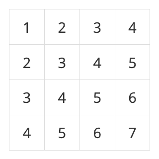
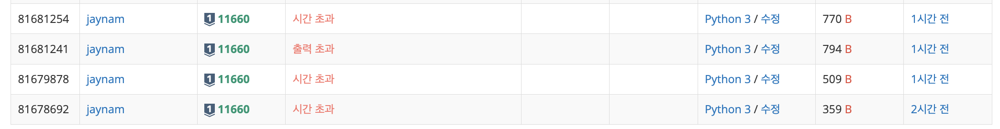
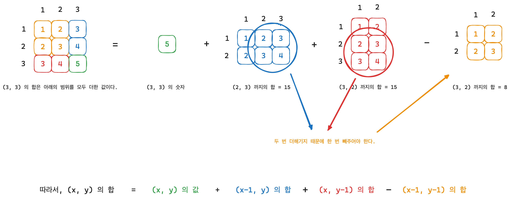
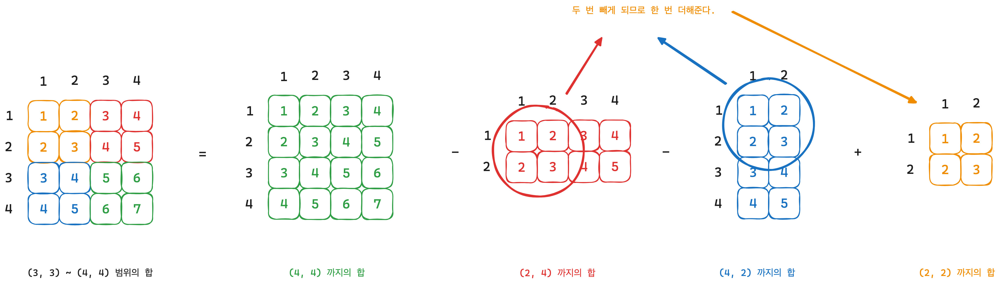

## 문제 링크
https://www.acmicpc.net/problem/11660 

<br>

## 문제 요약

N×N개의 수가 N×N 크기의 표에 채워져 있다. (x1, y1)부터 (x2, y2)까지 합을 구하는 프로그램을 작성하시오. (x, y)는 x행 y열을 의미한다.

예를 들어, N = 4이고, 표가 아래와 같이 채워져 있는 경우를 살펴보자.

 

여기서 (2, 2)부터 (3, 4)까지 합을 구하면 3+4+5+4+5+6 = 27이고, (4, 4)부터 (4, 4)까지 합을 구하면 7이다.

표에 채워져 있는 수와 합을 구하는 연산이 주어졌을 때, 이를 처리하는 프로그램을 작성하시오.

<br>

## 문제 풀이

처음에는 문제를 잘못 이해해서 해당 범위에 대해서만 합을 구해주려고 했었다.  
그렇게 되면 매번 계산을 해주게 되어 시간초과가 발생했다.  



<br>

보통 이럴 때 시간 초과가 발생한다면 대부분 동적 프로그래밍을 통해 풀어주면 된다고 생각했고 어떻게 풀어야할지 고민을 많이 했다.  

매 번 처음부터 모든 숫자를 더해 합을 구해줄 수 없기 때문에 이전에 구한 합을 통해서 다음 합을 구해주어야 했다.  

예를 들어, (1, 1) 부터 (3, 3) 까지 구한다고 했을 때 (1, 1) 부터 (1, 2) 의 합을 구하고 (1, 1) 부터 (1, 3) 의 합을 구해서 모든 합을 다 구해야 하기 때문에 시간이 오래 걸리 수 밖에 없다. 그래서 이전의 구한 합을 저장하고 다음 합을 구할 때 사용해야 한다.  

그래서 다음과 같이 점화식을 통해 모든 위치에서의 누적 합을 구해주었다.  

```python
dp = [[0] * (n+1) for _ in range(n+1)]

for i in range(1, n+1):
    for j in range(1, n+1):
        dp[i][j] = dp[i-1][j] + dp[i][j-1] - dp[i-1][j-1] + graph[i-1][j-1]
```

코드를 살펴보면 다음과 같은 점화식에 의해서 누적 합이 계산된다.  

> dp[i-1][j] + dp[i][j-1] - dp[i-1][j-1] + graph[i-1][j-1]

만약 예를 들어, 점화식을 통해 (3, 3) 의 합을 구하려고 한다면 다음과 같이 구할 수 있다.  

 

<br>

이렇게 모든 위치에서의 누적합을 구해준다. 따라서, 다음과 같이 모든 누적합이 구해진다.  

  

<br>

다음으로 원하는 범위의 누적합을 구하고 싶다면 이전에 다음과 같이 구할 수 있다.  

```python
if x1 == x2 and y1 == y2:
        result = graph[x1-1][y1-1]
else:
    if x1 == 1:
        result = dp[x2][y2] - dp[x2][y1-1]
    elif y1 == 1:
        result = dp[x2][y2] - dp[x1-1][y2]
    else:
        result = dp[x2][y2] - (dp[x1-1][y2] + dp[x2][y1-1] - dp[x1-1][y1-1])
```

이렇게 구한 이유는 위에서 구한 방식과 유사하게 구했다고 볼 수 있는데 예를 들어서 설명해보자.  

예를 들어, (2, 2) 에서 (3, 4) 까지의 합을 구하고 싶다고 해보자.  

  

<br>

또 다른 예로 (3, 3) 에서 (4, 4) 까지의 합을 구하고 싶다고 해보자.  

  

<br>

이렇게 누적합을 통해서 특정 범위의 누적합을 구해줄 수 있다.  


<br>

## 제출 답안

```python
import sys

n, m = map(int, sys.stdin.readline().split())
graph = []

for i in range(n):
    graph.append(list(map(int, sys.stdin.readline().split())))

dp = [[0] * (n+1) for _ in range(n+1)]

for i in range(1, n+1):
    for j in range(1, n+1):
        dp[i][j] = dp[i-1][j] + dp[i][j-1] - dp[i-1][j-1] + graph[i-1][j-1]

for _ in range(m):
    x1, y1, x2, y2 = map(int, sys.stdin.readline().split())
    
    if x1 == x2 and y1 == y2:
        result = graph[x1-1][y1-1]
    else:
        if x1 == 1:
            result = dp[x2][y2] - dp[x2][y1-1]
        elif y1 == 1:
            result = dp[x2][y2] - dp[x1-1][y2]
        else:
            result = dp[x2][y2] - (dp[x1-1][y2] + dp[x2][y1-1] - dp[x1-1][y1-1])
            
    print(result)
```