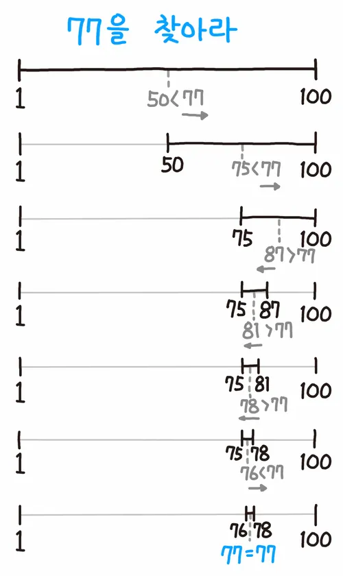

이진 탐색에 대해서 이해하기 전에 우리가 흔히 하는 게임 중 하나인 up & down 게임을 떠올려볼 수 있다. 
특정 숫자를 말하면 내가 생각한느 숫자보다 큰지 작은지를 확인해 크다면 up, 작다면 down 을 말해 힌트를 주게 된다.  

예를 들어, 내가 생각한 숫자가 10 이라고 할 때, 상대방이 5 를 말하면 up 이라고 말한다. 그럼 상대방의 머릿 속에선는 5 보다 더 큰 수라고 생각을 하고 5 보다 작은 숫자를 제외하게 된다.  

이와 같이 이진 탐색도 중간값을 기준으로 찾고자 하는 값이 중간값보다 큰지 작은지 비교한 후 제외시켜 나가는 방법이라고 할 수 있다. 조금 더 자세하게 이진 탐색에 대해서 이해해보자.  

<br>

## Binary Search (이진 탐색) 알고리즘 이란

이진 탐색 알고리즘은 오름차순으로 정렬되어있는 정수의 리스트를 같은 크기의 두 부분으로 나누고 필요한 부분만 탐색하도록 제한하여 원하는 원소를 찾는 알고리즘이다.  

탐색 알고리즘 중 가장 유명한 알고리즘이라고 한다. 그리고 이진 탐색은 리스트가 정렬이 되어있어야 한다는 점을 유의해야 한다.  
  
이해하기 쉽게 예를 들어 설명하는 것이 좋을 것 같다. 나무위키를 찾아보니 다음과 같이 예를 들어 설명하고 있었다.  

<div style="padding: 0 30%;">
    
</div>

<br>

위의 이미지를 보면 알 수 있듯이 1 ~ 100 사이에 있는 숫자 중에서 77을 찾는 과정을 그림으로 나타냈는데 먼저 중간인 50 과 크기를 비교하고 50 보다 크기 때문에 범위가 50 ~ 100 으로 줄어든다.
그리고 다시 50 ~ 100 의 중간인 75 와 비교한다. 77이 75 보다 크기 때문에 범위는 75 ~ 100 으로 줄어든다. 이와 같은 과정을 반복하게 되면 결국 77의 어디에 있는지 찾을 수 있게 된다.  

이렇게 얘제를 통해 쉽게 이진탐색에 대해서 이해할 수 있었다.  

<br>

## 이진 탐색 구현해보기

이진 탐색을 쉽게 이해하기 위해서 두 가지 예를 들어 구현하고 두 가지 방법에 대해서 비교해보려고 한다.  

첫 번째로는 <U>반복문</U>을 사용해서 원하는 값을 찾고 두 번째로는 <U>이진 탐색</U>을 사용해서 원하는 값을 찾아보려고 한다.  

그럼 예를 들어, 다음과 같이 리스트가 있다고 가정한다.  
여기서 한 가지 확인이 필요한 부분은 리스트는 항상 **정렬**이 되어있어야 한다.  

```python
[1, 2, 3, 4, 5, 6, 7, 8, 9, 10]
```

위의 리스트에서 `8` 이라는 숫자의 `index` 값을 찾아보자.  

<br>

### 반복문 사용해서 원하는 값 찾기

먼저 반복문을 통해 값을 찾아보자. 반복문을 사용해서 찾기 위해서는 정말 간단한게 구현해볼 수 있다.  

```python
def for_loop(arr, n):
    for i, num in enumerate(arr):
        if n == num:
            return i

arr = [1, 2, 3, 4, 5, 6, 7, 8, 9, 10]
n = 8

result = for_loop(arr, n)

print(n, "의 위치는", result, "입니다.")
```

- 실행 결과

```python
8 의 위치는 7 입니다.
```

enumerate() 함수를 사용해서 index 값과 숫자를 같이 가져올 수 있고 원하는 값이 나올 경우 멈추면 된다.  

따라서, 8 이라는 숫자의 index 값을 찾기 위해서는 1부터 8까지 값을 확인을 해야하기 때문에 시간 복잡도는 `O(N)` 이 된다.  

<br>

### 이진 탐색을 사용해서 원하는 값 찾기

이번에는 이진 탐색을 사용해서 8 의 index 값을 찾아보자.  

```python
def binary_search(arr, n):
    # 처음 범위는 첫 번째 인덱스 ~ 마지막 인덱스
    left = 0
    right = len(arr) - 1

    while left <= right:
        # 중간 값 계산
        mid = (left + right) // 2
        
        if arr[mid] == n:
            return mid
        
        # 중간 값보다 작을 경우
        if n < arr[mid]:
            right = mid - 1
        else:
            left = mid + 1
            
            
arr = [1, 2, 3, 4, 5, 6, 7, 8, 9, 10]
n = 8

result = binary_search(arr, n)

print(n, "의 위치는", result, "입니다.")
```

- 실행 결과

```python
8 의 위치는 7 입니다.
```

값을 찾을 때까지 계속해서 반으로 범위를 줄여가면서 값을 찾게 되고 중간 값이 원하는 값이 나올 경우 멈추게 된다.  

따라서, 계속해서 범위가 반으로 줄어들기 때문에 시간 복잡도는 `O(logN)` 이 된다.  

<br>

### for 반복문과 이진 탐색 비교

만약 리스트의 원소 개수가 적을 경우 두 가지 방법은 별 차이를 느끼지 못할 수도 있다.  

하지만 리스트의 원소 개수가 비정상적으로 많을 경우 원하는 값을 찾아야 한다면 계속해서 찾는 범위를 반으로 줄여나가는 이진 탐색을 사용했을 때 더 효율적으로 원하는 값을 찾을 수 있다.  

대략 10000 개의 원소를 가진 리스트가 있을 때 원하는 값을 찾을 때 두 가지 방법을 사용한다고 했을 때 시간을 비교해보았다.  

```python
import time

def for_loop(arr, n):
    for i, num in enumerate(arr):
        if n == num:
            return i

def binary_search(arr, n):
    # 처음 범위는 첫 번째 인덱스 ~ 마지막 인덱스
    left = 0
    right = len(arr) - 1

    while left <= right:
        # 중간 값 계산
        mid = (left + right) // 2
        
        if arr[mid] == n:
            return mid
        
        # 중간 값보다 작을 경우
        if n < arr[mid]:
            right = mid - 1
        else:
            left = mid + 1

arr = [n for n in range(1, 10001)]
n = 9999

stime = time.time()
for_result = for_loop(arr, n)
etime = time.time()

for_time = etime - stime
print("For loop 소요 시간은 ", for_time, "입니다.")

stime = time.time()
bs_result = binary_search(arr, n)
etime = time.time()

bs_time = etime - stime
print("binary search 소요 시간은 ", bs_time, "입니다.")
```

- 실행 결과

```python
For loop 소요 시간은  0.0002410411834716797 입니다.
binary search 소요 시간은  3.0994415283203125e-06 입니다.
```

시간을 보면 이진 탐색을 사용했을 경우 for 반복문을 사용했을 때보다 약 7~80 배 정도 빠르다는 것을 확인할 수 있다.  
당연히 리스트의 원소가 많아질수록 두 방법 간의 시간 차이가 더 많이 나는 것을 알 수 있고 이진 탐색을 사용하면 더 효율적으로 원하는 값을 찾을 수 있다.  

<br>

### 이 외의 다른 방법으로 구현하기

위에서는 while 문을 사용해서 구현하였는데 이 방법 외에도 재귀함수를 사용하여 이진 탐색을 구현할 수도 있다.  

```python
def binary_search(arr, n, left, right):
    if left > right:
        return -1
    
    mid = (left + right) // 2
    
    if arr[mid] == n:
        return mid
    elif n < arr[mid]:
        return binary_search(arr, n, left, mid-1)
    else:
        return binary_search(arr, n, mid+1, right)
    
arr = [1, 2, 3, 4, 5, 6, 7, 8, 9, 10]
n = 8

result = binary_search(arr, n, 0, len(arr)-1)

print(n, "의 위치는", result, "입니다.")
```

<br>

## 정리하기

이렇게 이진 탐색에 대해서 이해해보았고 직접 구현해보면서 어떻게 동작하는지 알아보았다.  

이진 탐색은 비재귀적 함수와 재귀적 함수를 통해서 구현할 수 있었다.  
비재귀적인 부분도 어떻게 보면 같은 과정을 매 번 반복하기 때문에 재귀적인 부분이라고 생각할 수도 있다.  

직접 구현해보면서 이진 탐색을 사용하게 되면 직접 원하는 값을 것보다 훨씬 효율적으로 원하는 값을 찾을 수 있다는 것을 알 수 있었고 
다만 이진 탐색을 사용한다고 했을 때 정렬이 되어있어야 한다는 점이 중요했고 리스트의 크기와 상관없이 빠른 속도를 가지고 있다는 점이 이진 탐색을 사용하는 이유라고 생각한다.  

이진 탐색과 관련된 여러 문제를 풀어보면서 이제 익숙해지면 될 것 같다!  

<br>

**[참고 자료]**  
[나무위키 - 이진탐색](https://namu.wiki/w/%EC%9D%B4%EC%A7%84%20%ED%83%90%EC%83%89)  