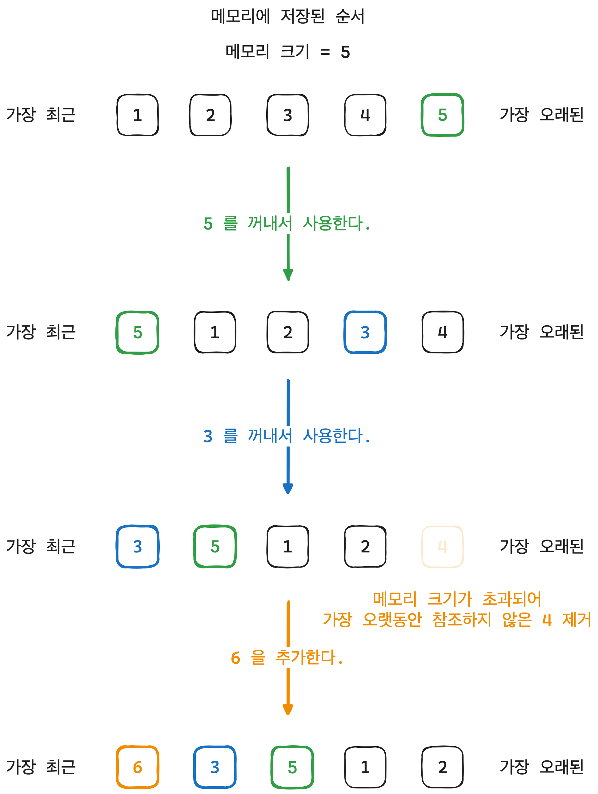
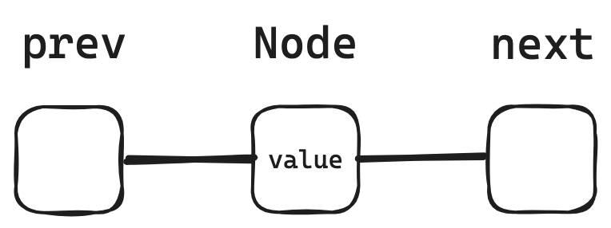
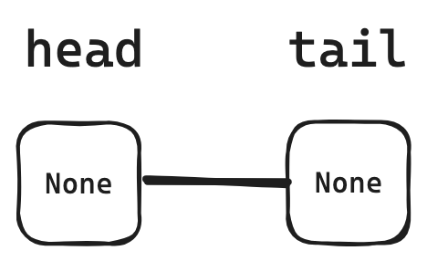
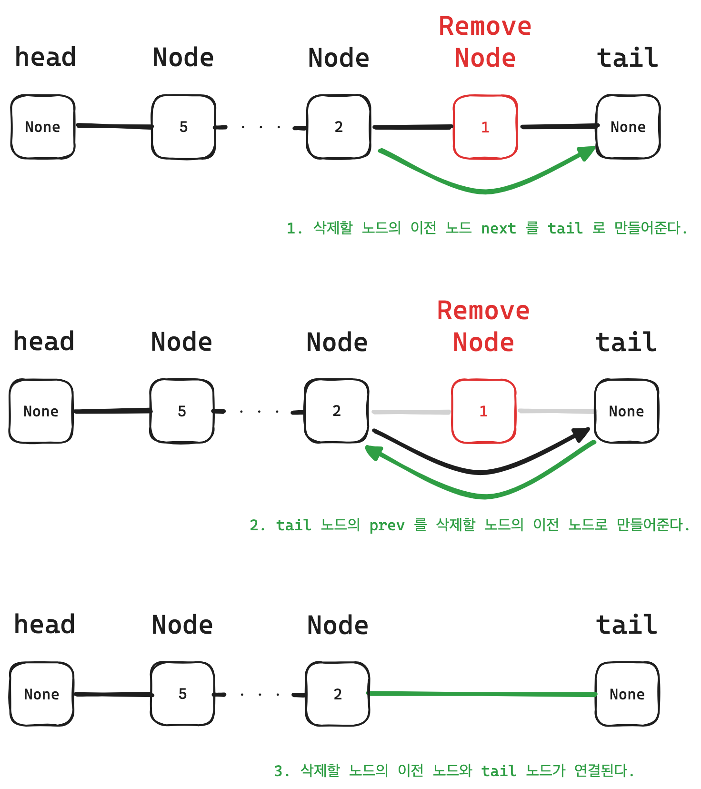
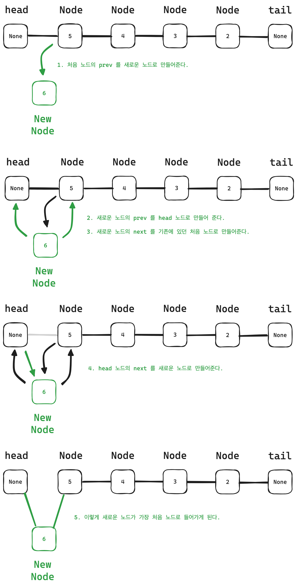
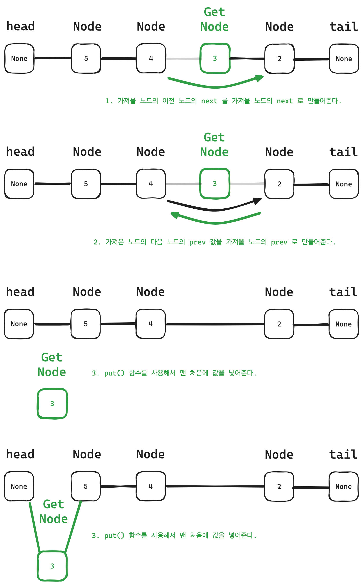

## LRU(Least Recently Used) 알고리즘이란

LRU 는 페이지 교체 알고리즘으로 가장 오랫동안 참조하지 않은 페이지를 교체하는 방식이다.  
말 그래도 가장 오랫동안 참조하지 않았다는 말은 앞으로도 사용될 가능성이 낮다는 내용에 의해 만들어진 알고리즘이라고 한다.  

<br>

## 페이지 교체 알고리즘이 뭐지?

페이지 교체 알고리즘은 페이징 기법으로 메모리를 관리하는 운영체제에서 페이지 부재가 발생하여 새로운 페이지를 할당하기 위해 현재 할당된 페이지 중 어느 것과 교체할지 결정하는 방법이다.  

페이지 교체 알고리즘의 에로 FIFO, LFU, LRU 등의 알고리즘이 있다고 한다.  

- FIFO

페이지가 주기억장치에 적재된 시간을 기준으로 교체될 페이지를 결정하는 기법이다.
중요한 페이지가 오래 있었다는 이유만으로 교체될 수 있다는 단점이 있다.
가장 오래 있었던 페이지는 앞으로도 계속 사용될 가능성이 있다.  

- LFU

가장 적은 횟수를 참조하는 페이지를 교체 하는 기법이다.
참조될 가능성이 많음에도 불구하고 횟수에 의한 방법이므로 최근에 사용된 프로그램을 교체시킬 가능성이 있고 해당 횟수를 증가시키므로 오버헤드가 발생할 수 있다.  

- LRU

가장 오랫동안 참조되지 않은 페이지를 교체하는 기법이다. 
프로세스가 주기억장치에 접근할때마다 참조된 페이지에 대한 시간을 알고 있어야 한다. 따라서, 큰 오버헤드가 발생한다.  

<br>

## LRU 알고리즘 이해하기

LRU 알고리즘을 이해하기 위해서 그림으로 그려보았다.  


  

먼저 기존에 메모리에 있는 값을 가져와 사용한다고 했을 때 가장 최근 사용했기 때문에 맨 앞으로 가게 된다.  

다음으로 새로운 값이 들어올 때 메모리 크기가 가득 차있지 않다면 값을 가장 최근인 앞으로 넣어주고  
메모리 크기가 가득 차 있다면 가장 오래된, 오랫동안 참조하지 않은 마지막 값을 빼고 새로운 값을 넣어준다.  

이와 같은 조건을 통해 LRU 알고리즘을 구현할 수 있다.  

<br>

## LRU 알고리즘 구현해보기

LRU 는 `더블 링크드 리스트(Double Linked List)` 를 통해 구현할 수 있다.  

먼저 만들어줘야하는 부분은 각 값을 가지고 있는 Node 를 만들어주어야 하고 Node 를 연결시켜주어야 한다.  

<br>

### Node class 생성하기

다음과 같이 Node class 를 생성해준다.

```python
class Node:
    def __init__(self, value, prev=None, next=None):
        self.value = value
        self.prev = prev
        self.next = next
```

그림으로 그려보면 다음과 같이 나타낼 수 있다.  

<div style="padding: 0 20%;">
    
</div>

<br>

### LRU class 생성하기

다음으로 더블 링크드 리스트를 사용해서 LRU class 가 필요하다. 그리고 더블 링크드 리스트는 head node 와 tail node 를 가지고 있다.  

따라서, 다음과 같이 class 를 생성해주었다.  
처음 생성할 때에는 아무런 값도 가지고 있지 않기 때문에 head 와 tail 을 연결해준다.  

```python
class LRU:
    def __init__(self, capacity) -> None:
        self.capacity = capacity
        self.head = Node(None)
        self.tail = Node(None)
        self.head.next = self.tail
        self.tail.prev = self.next
```

그림으로 그려보면 다음과 같이 나타낼 수 있다.  

<div style="padding: 0 30%;">
    
</div>

<br>

이제 기본적인 구성을 갖추었으니 LRU 알고리즘의 기능을 구현해보자.  

<br>

### 새로운 값 입력하기 (put)

먼저, 값을 넣는 기능부터 추가해보려고 한다.  

값을 입력할 때 고려해야할 점은 용량 체크를 해주어야 한다. 그래서 용량 체크하는 함수를 먼저 만들어주었다.  

```python
# LRU 용량 체크
def currentCapacity(self):
    count = 0
    
    node = self.head.next
    
    while node.value:
        count += 1
        node = node.next
        
    return count
```

처음 노드 다음 노드로 넘어가면서 노드의 개수를 세어준다. 

그리고 용량이 가득 찼을 경우 마지막 값을 빼주도록 만들어야 한다.  

```python
# 만약 용량이 가득 차있을 경우
if  self.currentCapacity() == self.capacity:
    # 가장 오랫동안 참조하지 않은 값을 제거
    remove_node = self.tail.prev
    remove_node.prev.next = self.tail
    self.tail.prev = remove_node.prev
```

코드로만 이해하기 어려우니 그림으로 그려보자.  

   

<br>

이런 과정을 거쳐 마지막 노드를 제거해준다.  

마지막 노드를 제거한 다음에 용량이 비어있으므로 새로운 노드를 맨 처음에 입력해주면 된다.  

```python
new_node = Node(value)

self.head.next.prev = new_node
new_node.prev, new_node.next = self.head, self.head.next
self.head.next = new_node
```

그림으로 그려서 이해해보자.  

   

<br>

이렇게 새로운 값을 맨 처음에 입력해줄 수 있다.  

따라서, 다음과 같이 put() 함수를 만들어주었다.  

```python
def put(self, value):
    # 만약 용량이 가득 차있을 경우
    if  self.currentCapacity() == self.capacity:
        # 가장 오랫동안 참조하지 않은 값을 제거
        remove_node = self.tail.prev
        remove_node.prev.next = self.tail
        self.tail.prev = remove_node.prev
    
    new_node = Node(value)
    
    self.head.next.prev = new_node
    new_node.prev, new_node.next = self.head, self.head.next
    self.head.next = new_node
    
    self.printAll()
```

<br>

### 값 가져오기 (get)

다음으로 값을 가져오는 기능을 만들어보자.  

갑을 가져오게 되면 최근에 참조한 값이 되기 때문에 값을 읽어 맨 처음에 입력해주어야 한다.  

따라서 가져온 값을 제거하고나서 맨 처음에 추가해주어야 한다.  

작성한 코드는 다음과 같다.  

```python
# 처음 값을 가져옴
node = self.head.next

while node.value:
    if node.value == value:
        node.prev.next, node.next.prev = node.next, node.prev
        self.put(value)
        return
    
    node = node.next
```

그림으로 그려서 쉽게 이해해보자.  
예를 들어, 3이라는 값을 참조한다고 할 때 다음과 같이 나타낼 수 있다.  

 

<br>

이와 같은 방법으로 값을 참조할 경우 제거해서 다시 맨 처음에 입력해주면 된다.  

따라서, 다음과 같이 get() 함수를 만들어주었다.  

```python
def get(self, value):
    # 처음 값을 가져옴
    node = self.head.next

    while node.value:
        if node.value == value:
            node.prev.next, node.next.prev = node.next, node.prev
            self.put(value)
            return
        
        node = node.next
```

<br>

### 기능 테스트

자 그럼 만든 기능들을 잘 동작하는지 테스트해보았다.  

```python
lru = LRU(5)
lru.put(1)
lru.put(2)
lru.put(3)
lru.put(4)
lru.put(5)
lru.get(3)
lru.put(6)
```

- 실행 결과

```python
[Current Capacity 0] => LRU : 1
[Current Capacity 1] => LRU : 2 -> 1
[Current Capacity 2] => LRU : 3 -> 2 -> 1
[Current Capacity 3] => LRU : 4 -> 3 -> 2 -> 1
[Current Capacity 4] => LRU : 5 -> 4 -> 3 -> 2 -> 1
[Current Capacity 4] => LRU : 3 -> 5 -> 4 -> 2 -> 1
[Current Capacity 5] => LRU : 6 -> 3 -> 5 -> 4 -> 2
```

테스트 결과 기본적인 LRU 알고리즘의 기능이 잘 동작하는 것을 확인할 수 있었다.  

<br>

### 전체 코드 참고

```python
class Node:
    def __init__(self, value, prev=None, next=None) -> None:
        self.value = value
        self.prev = prev
        self.next = next
        
class LRU:
    def __init__(self, capacity) -> None:
        self.capacity = capacity
        self.head = Node(None)
        self.tail = Node(None)
        self.head.next = self.tail
        self.tail.prev = self.head
        
        
    def put(self, value):
        # 만약 용량이 가득 차있을 경우
        if  self.currentCapacity() == self.capacity:
            # 가장 오랫동안 참조하지 않은 값을 제거
            remove_node = self.tail.prev
            remove_node.prev.next = self.tail
            self.tail.prev = remove_node.prev
        
        new_node = Node(value)
        
        self.head.next.prev = new_node
        new_node.prev, new_node.next = self.head, self.head.next
        self.head.next = new_node
        
        self.printAll()
        
    def get(self, value):
        # 처음 값을 가져옴
        node = self.head.next
        
        while node.value:
            if node.value == value:
                node.prev.next, node.next.prev = node.next, node.prev
                self.put(value)
                return
            
            node = node.next
    
    # LRU 용량 체크
    def currentCapacity(self):
        count = 0
        
        node = self.head.next
        
        while node.value:
            count += 1
            node = node.next
    
        print("[Current Capacity", count, end="] => LRU : ")
            
        return count
        
        
    # 모든 노드 출력
    def printAll(self):
        node = self.head.next
        
        while node.value:
            print(node.value, end="")
            
            node = node.next
            
            if node.value:
                print(" -> ", end="")
                
        print()
            
if __name__ == "__main__" :
    lru = LRU(5)
    lru.put(1)
    lru.put(2)
    lru.put(3)
    lru.put(4)
    lru.put(5)
    lru.get(3)
    lru.put(6)
```

<br>

## 정리하기

정리해보면 LRU 알고리즘은 페이지 교체 알고리즘으로 가장 오랫동안 참조하지 않은, 즉 사용하지 않은 값을 먼저 제거하는 알고리즘이라고 할 수 있다.  

LRU 알고리즘 외에도 페이지를 교체하기 위한 FIFO, LFU 등의 다른 알고리즘도 있으니 참고하면 좋을 것 같다.  

간단하게 더블 링크드 리스트로 LRU 알고리즘의 기능들을 구현해보았는데 더블 링크드 리스트를 사용하는 데 아직 많이 익숙하지 않다보니
기능을 만드는 과정에서 이해하려고 열심히 그림을 그려본 것 같다.  

내가 작성한 코드는 정답이 아니기도 하고 간단하게 LRU 알고리즘을 이해하기 위해서 아래의 참고 자료를 보고 따라서 구현해본 것이기 때문에 처음부터 다시 구현해보라고 한다면 과연 구현할 수 있을까 하는 의문이 든다. ㅎㅎ  

그래도 LRU 알고리즘에 대해서 조금은 이해가 된 것 같고 다른 분들이 정리해놓은 자료도 정말 많기 때문에 참고해서 보면 더 좋을 것 같다.  

<br>

**[참고 자료]**  
[LRU 알고리즘 (Least Recentely Used) 개념 및 구현방법](https://dailylifeofdeveloper.tistory.com/355)  
[LRU 알고리즘 (Least Recently Used Algorithm)](https://j2wooooo.tistory.com/121)  