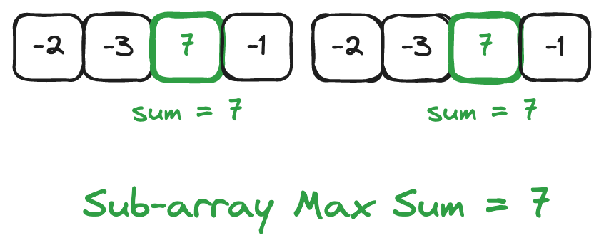
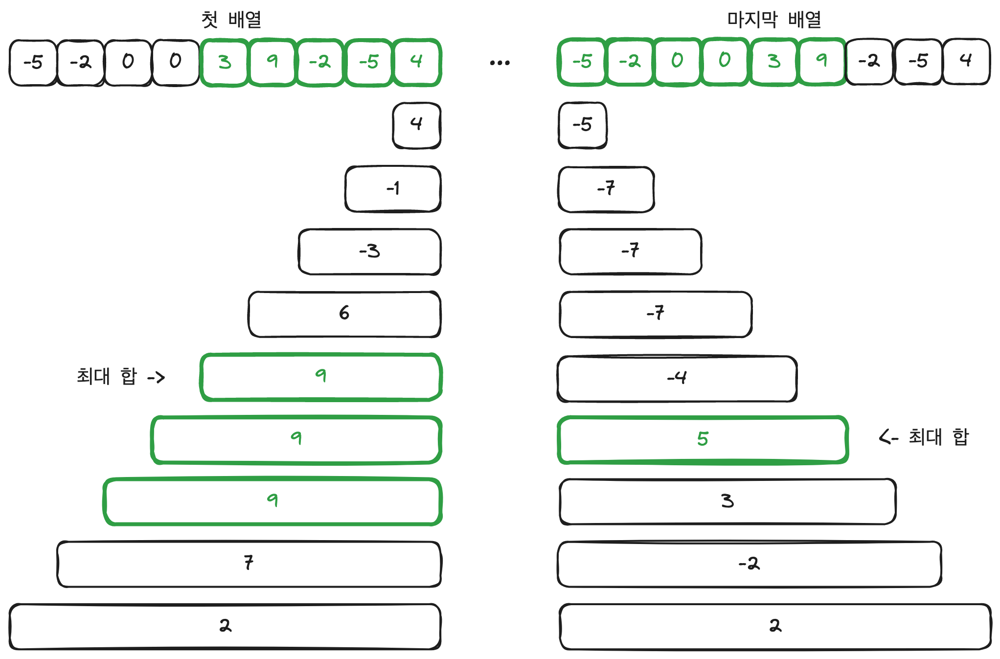

## 문제 링크
https://leetcode.com/problems/k-concatenation-maximum-sum/description/

## 문제 요약

정수 배열인 `arr` 과 정수 `k` 가 주어진다.  
`arr` 을 `k` 만큼 반복해서 배열을 수정한다.  

예를 들어, `arr = [1, 2]` 이고 `k = 3` 일 경우 수정된 배열은 `[1, 2, 1, 2, 1, 2]` 이 된다.  

<br>  

다음으로 이렇게 만들어진 배열 안에서 sub-array 를 구한다.  

예를 들어, `[1, 2, 1, 2, 1, 2]` 이 있다고 할 경우 sub-array 는 `[1, 2, 1]`, `[2, 1, 2]` 등 여러 경우가 있다.  

따라서, 만들 수 있는 sub-array 의 배열 중에서 원소의 합이 최대가 되는 값을 구하면 된다.  
위의 예시에서 sub-array 의 원소의 합이 최대가 되는 경우는 `[1, 2, 1, 2, 1, 2]` 가 되어 최대가 되는 sub-array 의 합은 `9` 가 된다.  

이렇게 주어진 배열과 k 값을 통해 sub-array 를 만들 수 있는 경우 중 원소의 합이 가장 큰 경우를 찾으면 된다.  

<br>

조건을 보면 arr 의 길이는 최대 `10^5` 그리고 k 는 최대 `10^5` 의 값을 가지기 때문에 최대 arr 의 길이가 `10^10` 이 된다.  

따라서 합이 너무 클 경우 모듈러 연산을 통해 `(10**9)+7` 로 나눈 나머지를 반환해준다.  

<br>

한 가지 유의하면서 풀어야 할 부분은 마이너스인 정수가 온다고 해도 제외하면 안된다는 점이다.  

예를 들어, `[-1, -1, 1, 2, 3, -1, -1, 1, 2, 3]` 일 경우 원소의 합이 최대가 되는 sub-array 는 전체가 되어 모든 원소를 더한 `10` 이 된다.  

<br>

## 문제 풀이

### 첫 번째 시도 - `실패`

첫 번째 시도에서는 k 만큼 반복된 배열을 만들어서 배열의 길이만큼 합계를 구해주면서 최대가 되는 합계를 반환하려고 했었다.  
테스트 코드에서는 다 통과했지만 정답으로 제출하니 배열을 만드는 과정에서 메모리가 부족해 Runtime Error 가 발생했다.  

- 실패한 코드 
    ```python
    class Solution:
        def kConcatenationMaxSum(self, arr: List[int], k: int) -> int:
            modulo = (10 ** 9) + 7
            k_arr = arr * k
            
            sum = 0
            max_sum = 0

            for i in range(len(k_arr)):
                sum += k_arr[i]

                if sum < 0:
                    sum = 0

                max_sum = max(max_sum, sum)

            return max_sum % modulo
    ```

- Runtime Error

    

<br>

그래서 다음과 같이 이중 배열로 변경해주었지만 여전히 Time Limit Exceeded 가 발생했다.  

- Time Limit Exceeded

    

<br>

배열의 길이만큼 계산을 하다보니 시간 복잡도가 `O(N)` 이고 배열의 최대 길이로 인해서 시간 초과라 발생하는 것 같다.  
제출 결과를 확인해봐도 k 가 57011 인 경우의 케이스에 대해서 시간 초과가 발생했다고 나온다.  
결국에는 시간 복잡도를 줄이기 위한 방법을 찾아봐야할 것 같다.  

<br>

### 두 번째 시도 - `성공`

두 번째 시도에서는 한 번에 처리하기에는 시간이 너무 오래걸린다고 생각해 쪼개서 계산을 해줘야할 것 같다는 생각이 들었던 것 같다.  
그래서 여러 테스트 케이스들을 통해 어떤 경우가 발생하는지에 대해서 찾아보았다.  

<br>

1) **`k = 1` 인 경우**  

    ```python
    arr = [-5,-2,0,0,3,9,-2,-5,4]
    k = 1
    ```

    이 케이스의 경우 배열이 하나 밖에 없기 때문에 배열 안에서 sub-array 의 값이 가장 큰 경우를 구해야 한다.  

    <br>

    <div style="padding: 0 150px;">
        
    </div>

    <br>

2) **`k = 2` 인 경우**  

    ```python
    arr = [1, -3, -4, 1]
    k = 2
    ```

    이 케이스의 경우 sub-array 가 2개의 배열만 포함하기 때문에 각각 합을 구해서 더해주어야 한다.  

    <br>

    <div style="padding: 0 150px;">
        
    </div>
    
<br>

3) **`k = 2` 이지만 sub-array 가 `하나의 배열` 에만 포함되는 경우**  

    ```python
    arr = [-2, -3, 7, -1]
    k = 2
    ```

    이 케이스의 경우에는 `sub-array` 를 찾아보면 원소가 하나밖에 없는 것을 확인하고 k = 1 인 경우와 마찬가지로 풀면 된다.  

    <br>

    <div style="padding: 0 150px;">
        
    </div>

<br>

4) **`k >= 3` 이고 sub-array 가 `모든 배열`에 포함되는 경우**  

    ```python
    arr = [-5,-2,0,0,3,9,-2,-5,4]
    k = 4
    ```

    이 케이스의 경우 모든 배열을 다 포함하고 있기 때문에 양 끝에 있는 배열의 합과 가운데 있는 배열의 합을 구해서 더해주어야 한다.  

    <br>

    

    <br>

<br>

5) **`k >= 3` 이지만 sub-array 가 `두 개의 배열` 에만 포함되는 경우**  

    ```python
    arr = [1,-2,1]
    k = 5
    ```

    이 케이스의 경우 `sub-array` 가 2개의 배열에만 포함되기 때문에 k = 2 인 경우와 마찬가지로 풀면 된다.  

    <br>

    

    <br>

<br>

6) **`k >= 3` 이지만 sub-array 가 `하나의 배열` 에만 포함되는 경우**  

    ```python
    arr = [-5,4,-4,-3,5,-3]
    k = 3
    ```

    이 케이스의 경우에는 `sub-array` 를 찾아보면 원소가 하나밖에 없는 것을 확인하고 k = 1 인 경우와 마찬가지로 합을 구해준다.  
    그리고 또 하나의 조건을 확인할 수 있는 것은 가운데 배열의 합이 음수가 되므로 가운데 배열의 합이 음수가 되는 경우를 확인해서 합을 구해줄 수 있다.  

    <br>

    

    <br>

<br>

7) 이 외의 테스트 케이스들  

    - 모든 배열의 원소가 10000 인 경우
        - 이런 경우는 모든 합을 더해서 모듈러 연산을 통해 sub-array 의 합을 구해주었다.  
    - 배열의 원소가 모두 음수인 경우
        - 문제의 조건에 맞게 0 으로 반환해준다.  

<br>

위와 같은 여러 케이스들을 정리하고나서 이러한 과정을 코드로 옮겼다.  

먼저 k = 1 인 경우 하나의 배열에서 sub-array 의 최대 합을 구해주었다.  

```python
# k = 1 인 경우 하나의 배열에서 최대 합계 구하기
    def max_subarray_sum(arr: List[int]):
        cur_sum = 0
        max_sum = 0

        for num in arr:
            cur_sum = max(num, num+cur_sum)
            max_sum = max(max_sum, cur_sum)

        return max_sum
```

<br>

그리고 다음으로 k 가 2 이상이 경우 양 끝의 배열의 경우 별도로 합을 계산해주어야 한다.  
첫 배열의 경우 가장 마지막 원소부터 합을 구해야하고 마지막 배열의 경우 가장 처음 원소부터 합을 구해줘야 한다.  

예를 들어 다음과 같이 합을 구해야 한다.  

<br>



<br>

따라서, 이와 같은 코드는 다음과 같이 작성해주었다.  

```python
# k = 2 이상인 경우 가장 앞의 배열의 최대 합계 구하기
# index = 0 부터 최대 합계를 구한다.
def max_prefix_sum(arr: List[int]):
    max_sum = 0
    cur_sum = 0

    for num in arr:
        cur_sum += num
        max_sum = max(cur_sum, max_sum)

    return max_sum

# k = 2 이상인 경우 가장 뒤의 배열의 최대 합계 구하기
# index = len(arr) 부터 최대 합계를 구한다.
def max_suffix_sum(arr: List[int]):
    max_sum = 0
    cur_sum = 0

    for num in reversed(arr):
        cur_sum += num
        max_sum = max(cur_sum, max_sum)

    return max_sum
```

<br>

이제 각 경우에 대해서 계산을 해주면 된다.  

**k = 1 인 경우**  
- 하나의 배열만 가지고 있기 때문에 arr 안에서 sub-array 의 합을 구한다.  

```python
max_one_sum = max_subarray_sum(arr=arr)

# k = 1 인 경우 하나의 배열 밖에 없기 때문에 하나의 배열 안에 subarray 의 합을 구한다. 
if k == 1:            
    return max_one_sum
```

**k = 2 인 경우**  
- sub-array 가 하나의 배열 안에 있는 경우와 2개의 배열에 포함되어있는 경우를 확인해서 합을 구해준다.  

```python
# 모듈러 연산을 위한 계산
modulo = (10 ** 9) + 7

# k = 2 인 경우 두 개의 배열이 붙기 때문에 앞의 배열과 뒤의 배열의 합계를 구해야 한다.
if k == 2:
    return max(max_one_sum, max_pre_sum + max_suf_sum) % modulo
```

**k >= 3 인 경우**  
- 먼저 중간 배열의 모든 합을 구해준다. 이 때, 중간 배열의 모든 합은 앞, 뒤 배열을 제외한 k-2 개의 배열이 된다.  
- 중간 배열의 모든 합이 음수이면 sub-array 가 하나의 배열에 포함하는 경우와 2개의 배열에 포함하는 경우로 나눌 수 있다.  
- 중간 배열의 모든 합이 양수이면 sub-array 가 전체 배열에 포함되는 경우와 하나의 배열에 포함된느 경우로 나눌 수 있다.  

```python
# 모듈러 연산을 위한 계산
modulo = (10 ** 9) + 7

# k > 3 인 경우 앞, 뒤의 배열에 대한 합과 중간 배열의 합을 비교한다.
# 가운데 배열의 합이 0보다 작으면 배열이 하나일 경우와 2개일 경우를 비교해서 합을 구한다.
else:
    # 가운데 배열의 합, 앞 뒤의 배열이 2개 빠지기 때문에 개수는 k-2 이다.
    max_mid_sum = sum(arr) * (k-2)

    if max_mid_sum < 0:
        return max(max_one_sum, max_pre_sum + max_suf_sum) % modulo
    else:
        return max(max_one_sum, max_pre_sum + max_suf_sum + max_mid_sum) % modulo
```


<br>

## 제출 답안

```python
class Solution:
    def kConcatenationMaxSum(self, arr: List[int], k: int) -> int:
        # k = 1 인 경우 하나의 배열에서 최대 합계 구하기
        def max_subarray_sum(arr: List[int]):
            cur_sum = 0
            max_sum = 0

            for num in arr:
                cur_sum = max(num, num+cur_sum)
                max_sum = max(max_sum, cur_sum)

            return max_sum

        # k = 2 이상인 경우 가장 앞의 배열의 최대 합계 구하기
        # index = 0 부터 최대 합계를 구한다.
        def max_prefix_sum(arr: List[int]):
            max_sum = 0
            cur_sum = 0

            for num in arr:
                cur_sum += num
                max_sum = max(cur_sum, max_sum)

            return max_sum

        # k = 2 이상인 경우 가장 뒤의 배열의 최대 합계 구하기
        # index = len(arr) 부터 최대 합계를 구한다.
        def max_suffix_sum(arr: List[int]):
            max_sum = 0
            cur_sum = 0

            for num in reversed(arr):
                cur_sum += num
                max_sum = max(cur_sum, max_sum)

            return max_sum

        # 모듈러 연산을 위한 계산
        modulo = (10 ** 9) + 7

        k_max_sum = 0

        max_one_sum = max_subarray_sum(arr=arr)

        # k = 1 인 경우 하나의 배열 밖에 없기 때문에 하나의 배열 안에 subarray 의 합을 구한다. 
        if k == 1:            
            return max_one_sum

        max_pre_sum = max_prefix_sum(arr=arr)
        max_suf_sum = max_suffix_sum(arr=arr)
        max_all_sum = sum(arr)
        
        # k = 2 인 경우 두 개의 배열이 붙기 때문에 앞의 배열과 뒤의 배열의 합계를 구해야 한다.
        if k == 2:
            return max(max_one_sum, max_pre_sum + max_suf_sum) % modulo
        # k > 3 인 경우 앞, 뒤의 배열에 대한 합과 중간 배열의 합을 비교한다.
        # 가운데 배열의 합이 0보다 작으면 배열이 하나일 경우와 2개일 경우를 비교해서 합을 구한다.
        else:
            # 가운데 배열의 합, 앞 뒤의 배열이 2개 빠지기 때문에 개수는 k-2 이다.
            max_mid_sum = sum(arr) * (k-2)

            if max_mid_sum < 0:
                return max(max_one_sum, max_pre_sum + max_suf_sum) % modulo
            else:
                return max(max_one_sum, max_pre_sum + max_suf_sum + max_mid_sum) % modulo
```

<br>

- 실행 결과  

