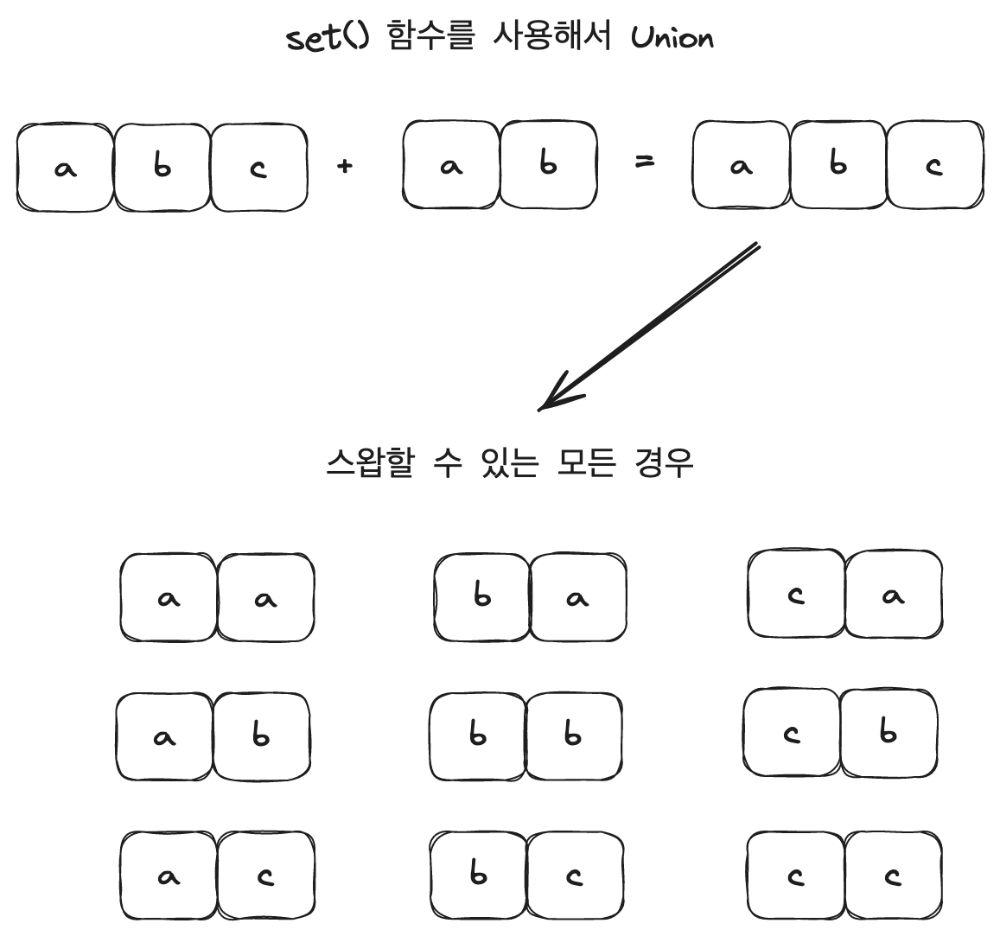

## 문제 링크

https://leetcode.com/problems/make-number-of-distinct-characters-equal/

<br>

## 문제 요약

문자열 `word1` 와 `word2` 가 주어진다. word1 의 인덱스 i 의 값과 word2 의 인덱스 j 의 값을 가져와 스왑을 하게 된다. (word1[i] <-> word2[j])  
이 때, 단 한 번만 스왑을 하게 될 경우 word1 과 word2 의 고유 문자의 개수가 같아질 수 있는가에 대해서 판별하는 문제다.  

쉽게 말해서 word1 에서 문자 한 개와 word2 에서 문자 한 개를 가져와서 서로 바꾸었을 때 중복을 제외한 나머지 문자의 개수가 같은지 확인하면 되는 문제다.  

만약, 고유한 문자의 갯수가 같다면 `True`, 다르다면 `False` 를 반환하면 된다.  

예를 들어, `word1 = "abcc"` 와 `word2 = "aab"` 라는 문자열이 주어질 때 각 문자열에서 문자 하나씩 가져와 스왑을 하게 된다면 다음과 같은 경우가 성립하게 된다.  

word1 의 문자열 `"abcc"` 에서 `"c"` 문자와 word2 의 문자열 `"aab"` 에서 `"a"` 문자를 스왑하게 되면 word1 은 `"abac"` 가 되고 word2 는 `"cab"` 가 된다.  

그리고 고유 문자의 수를 따져보면 `word1` 은 `"a", "b", "c"` 의 문자로 `3개` 가 되고, `word2` 는 `"a", "b", "c"` 로 word1 과 같이 문자 `3개` 가 된다.  

따라서, 이런 경우 고유한 문자의 갯수가 동일하기 때문에 `True` 를 반환하게 된다.  

<br>

## 문제 풀이

이 문제는 시작부터 어떻게 풀어야할지 되게 막막했던 것 같다. 문자를 스왑하는 부분을 어떻게 처리해줄 수 있을까? 에 대한 고민을 많이 했던 것 같다.
그래서 떠오른 방법이 스왑할 문자의 짝을 만들어서 하나씩 다 바꿔주자고 생각했고 모든 스왑이 가능한 경우를 구해서 고유한 문자의 수를 비교해주었다.  

하지만 예외 케이스들이 나오게 되면서 하나씩 풀어가야했고 그 결과 풀었지만 시간이 6146 ms ... 거의 꼴등이었다.  

그래서 하나의 예제를 통해 내가 푼 방법과 최적화를 통해 최적으로 푼 방법을 비교해봤다.  

- 예제

```python
Input: word1 = "abcc", word2 = "aab"
Output: true
```

<br>

### 내가 푼 방법

나는 먼저 word1, word2 를 `set()` 함수를 통해 고유한 문자를 구해주었다.  

```python
# dw is distinct word
dw1 = set(word1)
dw2 = set(word2)
```

<div style="padding: 0 150px;">
    
</div>  

<br><br>

그리고 고유한 문자의 개수가 똑같고 고유한 문자가 같다면 스왑을 해도 똑같기 때문에 `True` 를 반환해주었다.  

```python
if len(dw1) == len(dw2):
    if dw1 == dw2:
        return True
```

다음으로 두개의 고유한 문자를 합쳐서 스왑할 수 있는 모든 경우를 구해주었다.  

```python
union_dw = dw1 | dw2

fair = []

for i in union_dw:
    for j in union_dw:
        fair.append([i, j])
```

<div style="padding: 0 150px;">
    
</div>

<br><br>

마지막으로 모든 경우의 수를 다 계산해준다.  
원래의 문자열을 복사해 리스트로 만들어주고 remove() 함수와 append() 함수를 통해 스왑할 문자를 더하고 빼준다.   
그리고 set 함수를 통해 고유 문자의 수를 비교한다.  

그렇게 개수가 같으면 True 같은 경우가 없다면 False 를 반환하게 된다.  

```python
for a, b in fair:
    tdw1 = list(word1)
    tdw2 = list(word2)

    if a not in tdw1 or b not in tdw2:
        continue

    tdw1.append(b)
    tdw1.remove(a)
    
    tdw2.append(a)
    tdw2.remove(b)

    if len(set(tdw1)) == len(set(tdw2)):
        return True

return False
```


<br>

이렇게 코드를 작성하였는데 먼저 모든 페어를 구해준다는 부분에서 시간복잡도가 `O((m+n)^2)` 으로 시간이 오래 걸릴 것이고 리스트에 스왑할 문자를 넣고 빼고 비교하는 과정에서도 시간 복잡도가 `O((m+n)^3)` 으로 많은 시간이 걸리게 된다.  

다행히도 커트라인 끝에 걸려 문제를 풀 수 있었지만 어떻게 하면 더 간단하게 풀 수 있고 최적화시킬 수 있을까 고민하다가 결국 다른 사람의 풀이를 보게 되었는데... 전혀 생각지못한 방법이기도 했고 너무 간단해서 내가 너무 복잡하게 생각한건가 싶었다.  

<br>

### 다른 사람이 푼 방법

다른 사람이 푼 방법은 아래와 같았다.  

먼저, 문자열의 `Counter()` 함수를 사용해서 문자열 내의 문자의 개수를 구해준다.  

Counter() 함수를 모르는 것도 아닌데 왜 생각을 못했을까...  
Counter() 함수를 보자마자 굳이 직접 스왑해줄 필요 없이 하나 빼고 더하고만 해도 되는구나 하는 생각이 들었다.  

```python
w1_counter = Counter(word1)
w2_counter = Counter(word2)
```

- 출력 결과

```python
Counter({'c': 2, 'a': 1, 'b': 1})
Counter({'a': 2, 'b': 1})
```

그럼 다음과 같이 dictionary 로 카운팅되어 출력된다.  

<div style="padding: 0 150px;">
    
</div>

<br>

이제 이 문자를 하나씩 가져와서 모든 경우에 대해서 스왑을 진행해주면 되는데 스왑이 되었을 경우를 가정하고 문자의 개수를 세어주었다.  

먼저 각 문자열에서 단어와 개수를 가져온다.  

```python
for c1, v1 in w1_counter.items():
    for c2, v2 in w2_counter.items():
        ...
```

그리고 먼저 현재 두 문자의 길이를 가져온다.   

```python
w1_len = len(w1_counter)
w2_len = len(w2_counter)
```

<div style="padding: 0 200px;">
    
</div>

<br>

다음으로 첫 번째 문자열 먼저 스왑되는 경우를 계산한 다음 두 번째 문자열도 마찬가지로 스왑되는 경우를 계산해준다.  

```python
# --- word1 스왑 ---

# 문자가 하나만 있을 경우
if v1 == 1:
    w1_len -= 1

# 문자가 없거나 이미 있는 경우
if c2 not in w1_counter or (v1 == 1 and c1 == c2):
    w1_len += 1

# --- word2 스왑 ---

# 문자가 하나만 있을 경우
if v2 == 1:
    w2_len -= 1

# 문자가 없거나 이미 있는 경우
if c1 not in w2_counter or (v2 == 1 and c1 == c2):
    w2_len += 1
```

 

<br>

마지막으로 두 문자열의 길이가 같은지 계산한다.  

```python
if w1_len == w2_len:
    return True
```

정리해보자면, 나는 직접 스왑되는 과정을 리스트로 구현을 했지만 이 방법에서는 개수를 통해 더해주고 빼주고 하면서 문자열이 스왑되는 과정을 계산했다.  

다른 사람의 코드를 보면서 느낀 점은 너무 복잡하게 생각하고 문제를 풀었던 것 같고 조금 더 단순하게 풀 수 있는 방법을 더 많이 고민하고 시도해 봐야겠다.  


<br>

## 제출 답안

### 처음 제출한 답안

```python
"""
실행 시간 : 6146 ms
메모리 크기 : 20.80 MB
시간 복잡도 : O(word1.length * word2.length) == O(N^2)
"""
class Solution:
    def isItPossible(self, word1: str, word2: str) -> bool:
        # dw is distinct word
        dw1 = set(word1)
        dw2 = set(word2)

        if len(dw1) == len(dw2):
            if dw1 == dw2:
                return True

        union_dw = dw1 | dw2

        fair = []

        for i in union_dw:
            for j in union_dw:
                fair.append([i, j])

        for a, b in fair:
            tdw1 = list(word1)
            tdw2 = list(word2)

            if a not in tdw1 or b not in tdw2:
                continue

            tdw1.append(b)
            tdw1.remove(a)
            
            tdw2.append(a)
            tdw2.remove(b)

            if len(set(tdw1)) == len(set(tdw2)):
                return True

        return False
```

- 실행 결과

 

<br>

### 참고 답안

```python
"""
실행 시간 : 106 ms
메모리 크기 : 17.62 MB
시간 복잡도 : O(word1.length * word2.length) == O(N^2)
"""

class Solution:
    def isItPossible(self, word1: str, word2: str) -> bool:
        w1_counter = Counter(word1)
        w2_counter = Counter(word2)

        for c1, v1 in w1_counter.items():
            for c2, v2 in w2_counter.items():
                w1_len = len(w1_counter)
                w2_len = len(w2_counter)
                
                # --- word1 스왑 ---

                # 문자가 하나만 있을 경우
                if v1 == 1:
                    w1_len -= 1
                
                # 문자가 없거나 이미 있는 경우
                if c2 not in w1_counter or (v1 == 1 and c1 == c2):
                    w1_len += 1

                # --- word2 스왑 ---

                # 문자가 하나만 있을 경우
                if v2 == 1:
                    w2_len -= 1
                
                # 문자가 없거나 이미 있는 경우
                if c1 not in w2_counter or (v2 == 1 and c1 == c2):
                    w2_len += 1

                if w1_len == w2_len:
                    return True
            
        return False
```

- 실행 결과

 