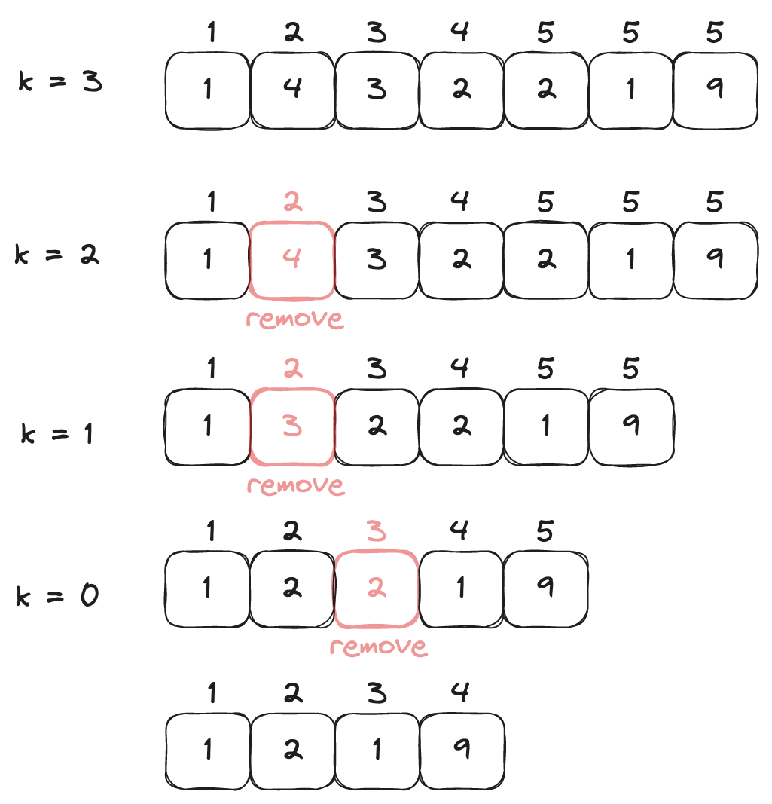
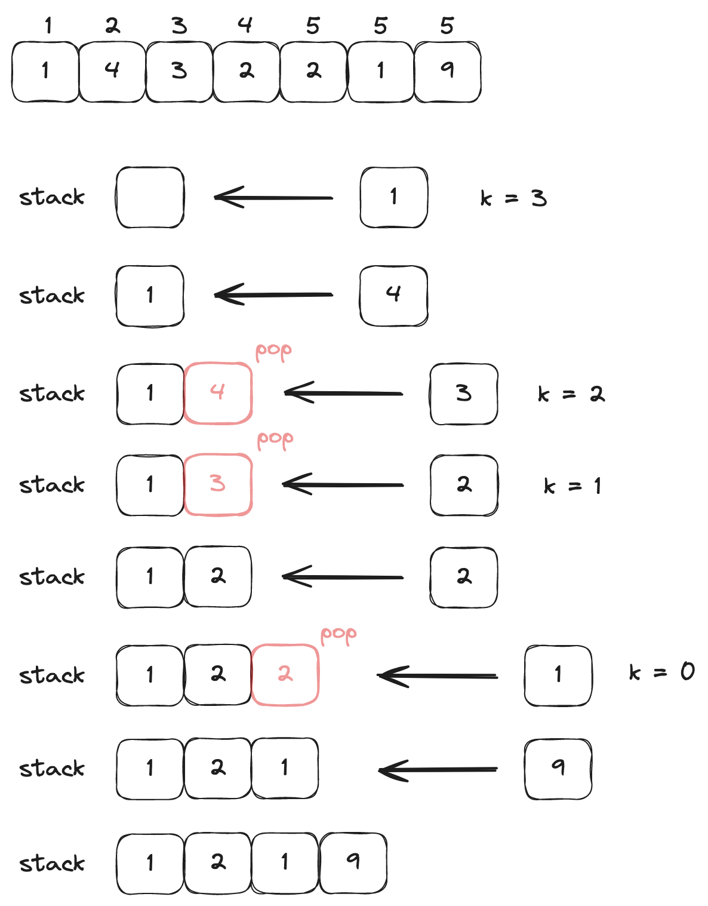

## 문제 링크
https://leetcode.com/problems/remove-k-digits/  

## 문제 요약

음수가 아닌 정수를 나타내는 `num` 이라는 문자열이 주어지고 정수인 `k` 가 주어진다.  

문자열 `num` 에서 `k` 개의 숫자를 지웠을 때 가장 작은 숫자가 되는 경우를 구하면 된다.  

<br>

## 문제 풀이

문제가 너무 간단하게 적혀있기 때문에 예를 통해 문제를 이해해 보려고 한다. 

예를 들어, `num = "1432219"`, `k = 3` 인 경우 4, 3, 2 가 지워져서 `"1219"` 가 가장 작은 문자열이 된다.  

문제에는 나와있지 않지만 유의해야할 점은 **<U>정렬을 할 수 없고 제외한 문자를 그대로 붙여주어야 한다</u>** 는 점이다. 

그렇기에 당연히 가장 큰 숫자만 제외하고 합쳐주게 되면 더 작은 경우를 놓치게 된다. 따라서 빠지게 되는 문자를 지운 채 합쳐주어야 한다.  

만약 가장 큰 숫자만 제외하게 된다면 `1` <S>4 3</S> `2 2 1` <S>9</S> 이 되어 `1 2 1 9` 보다 큰 정수가 된다.  

따라서 `1` <S>4 3 2</S> `2 1 9` 와 같이 중간에 있는 `3개(4, 3, 2)` 의 문자가 제거되면서 다시 합쳐져 가장 작은 정수를 나타내는 문자열이 된다는 것은 생각하며 문제를 풀어야 한다.  

미지막으로 num 의 정수 갯수와 k 가 같다면? 그럼 모든 정수가 제외되기 때문에 "0" 을 출력해주면 된다.  

<br>

자, 그래서 이 문제의 풀기 위한 핵심은 다음과 같다.  

<input type="checkbox" checked /> **k 개의 정수를 제외한 후 정렬은 할 수 없다.**  
<input type="checkbox" checked /> **더 작은 정수 문자열을 만들기 위해서는 큰 단위의 숫자가 작아야 한다. (왼쪽으로 갈수록 큰 단위)**   
<input type="checkbox" checked /> **num 의 정수 갯수와 k 가 같다면 모든 정수가 제외되므로 "0" 이 된다.**

위의 조건을 살펴보면 결국에는 <U>앞자리가 더 작으면 된다</U> 는 말이다.  

<br>

위의 조건에 따라 코드를 작성해보았는데 두 가지 방법을 통해 풀어보았다.  

참고로 두 가지 방법으로 풀 때 아래의 조건은 꼭 넣어주었다.  

```python
if len(num) <= k:
    return "0"
```

<br>

### List 로 만들어서 풀어보기

처음에는 리스트로 만들어서 현재 위치한 숫자보다 앞에 위치한 숫자를 더 작게 만들어주면 되지 않을까? 하는 생각을 하게 되었다.  

그래서 문자열인 `num` 을 `List` 로 만들어주었다.  

```python
num_list = list(num)
```

먼저, num 의 첫 번째 정수는 가장 처음오는 숫자여서 비교할 대상이 없어 건너뛰고 다음 정수부터 비교를 해주었다.  

```python
i = 1

 while i < len(num_list) and k > 0:
    if num_list[i-1] > num_list[i]:
        num_list.pop(i-1)
        k -= 1
        i = 1
    else:
        i += 1
```

만약 앞의 정수가 현재 위치한 정수보다 더 크다면 해당 정수를 리스트에서 제거해주었다.  
그럼 하나의 정수가 제외되었기 때문에 k 가 하나 줄어든다. (k - 1)  
그리고 다시 처음으로 돌아가 같은 방법으로 비교해서 k 개 만큼 정수를 제외시켜준다.  

이때, 비교가 끝나더라도 제외할 숫자가 남아있는 경우에는 뒤에서부터 정수를 제거해주면 된다.  
그 이유는 앞에서 비교했을 때 앞의 숫자가 더 작은 숫자가 오도록 비교를 해주었기 때문에 뒤에서 부터 제거해주면 된다.  

이 과정을 이해하기 쉽게 그림으로 나타내보았다.  

<br>



<br>

따라서, 다음과 같이 k 가 있는 경우 제외를 시켜준다.  

```python
if k > 0:
    num_list = num_list[:-k]
```

이제 리스트를 하나의 문자열로 합쳐주면 되는데 `join()` 함수를 통해서 합쳐주되 앞에 0 이 오면 안되기 때문에 왼쪽에 "0" 이 있는 경우에는 `lstrip()` 함수를 사용해서 제외시켜주었다.  
마지막으로 남아있는 정수가 없다면 "0" 있다면 합쳐준 문자열을 반환하면 된다.  

```python
return "".join(num_list).lstrip("0") if "".join(num_list).lstrip("0") else "0"
```

이렇게 리스트를 사용해서 문제를 풀어보았는데 결과를 확인해보니 실행 시간이 거의 꼴등이었다.  
그 이유는 아무래도 비교하고나서 다시 처음으로 돌아가 모든 리스트를 다시 비교하고 반복하기 때문에 속도가 매우 느릴 수 밖에 없는 것 같다.  

그래서 리스트가 아닌 스택을 사용해서 문제를 풀어보기로 했다.  

<br>

### Stack 으로 풀어보기

스택으로 문제를 푸는 방법으로는 위에서 얘기했던 조건 중 하나인 현재 자리의 정수보다 앞 자리 정수가 더 작아야 한다는 점을 생각해서 풀 수 있었다.  
만약 스택에 정수를 넣으려고 할 때 더 큰 정수가 있다면 꺼내고 정수를 넣어주면 된다.  

먼저, 스택으로 사용할 리스트를 하나 만들어준다.  

```python
stack = []
```

다음으로 `num` 에 있는 숫자를 하나씩 가져와 `stack` 에 넣어주려고 한다.  
위에서 말한 조건에 맞는 정수를 넣기 위해서는 `stack` 에 들어가있는 원소 중 들어가려고 하는 정수보다 큰 값이 존재하면 꺼내서 제외시켜준다.  
그렇게 정수를 다 꺼내고나서 들어가려고 했던 정수를 넣어준다.  

이와 같은 과정을 정수를 넣을 때마다 k 만큼 반복해주게 된다.  
이때, 리스트와 다른 점은 굳이 처음으로 돌아가지 않아도 된다는 점이다.  

```python
for digit in num:
    while stack and digit < stack[-1] and k > 0:
        stack.pop()
        k -= 1
    stack.append(digit)
```

이와 같은 과정을 이해하기 쉽게 그림으로 나타내보았다. 

<br>



<br>

비교가 끝나고나서 k 가 남아있는 경우에는 리스트에서 했던 방식으로 뒤에서 부터 정수를 제외시켜주고 문자를 합쳐준 다음 앞에 있는 "0" 을 제외시켜주었다.  

```python
return "".join(stack[:-k] if k else stack).lstrip('0') or '0'
```

리스트로 풀었을 때에는 매번 처음부터 다시 비교를 해주었어야 했기 때문에 시간이 오래 걸린 반면에 스택을 사용하게 되면 마지막 원소만 비교해주면 되기 때문에 훨씬 효율적으로 풀 수 있었던 것 같다.  


<br>

## 제출 답안

### List 로 만들어서 푼 답안

```python
"""
실행 시간 : 287ms
메모리 크기 : 17.90MB
시간 복잡도 : O(N)
"""

class Solution:
    def removeKdigits(self, num: str, k: int) -> str:
        if len(num) <= k:
            return "0"

        num_list = list(num)

        i = 1

        while i < len(num_list) and k > 0:
            if num_list[i-1] > num_list[i]:
                num_list.pop(i-1)
                k -= 1
                i = 1
            else:
                i += 1

        if k > 0:
            num_list = num_list[:-k]

        return "".join(num_list).lstrip("0") if "".join(num_list).lstrip("0") else "0"
```
<!--  -->


### Stack 으로 푼 답안

```python
"""
실행 시간 : 36ms
메모리 크기 : 17.93MB
시간 복잡도 : O(N)
"""

class Solution:
    def removeKdigits(self, num: str, k: int) -> str:
        if len(num) <= k:
            return "0"

        stack = []

        for digit in num:
            while stack and digit < stack[-1] and k > 0:
                stack.pop()
                k -= 1
            stack.append(digit)

        return "".join(stack[:-k] if k else stack).lstrip('0') or '0'
```

<!--  -->
