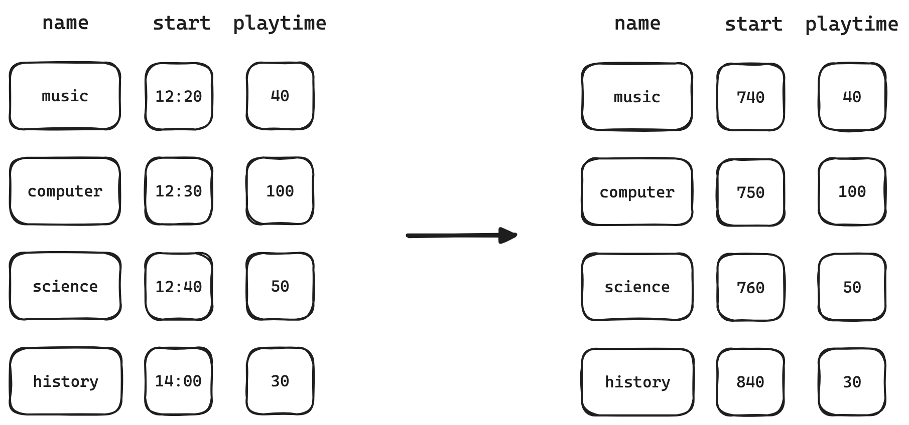
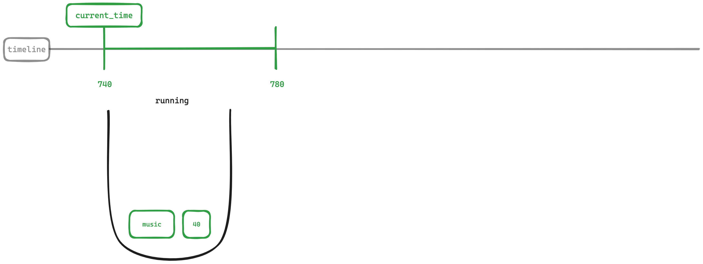
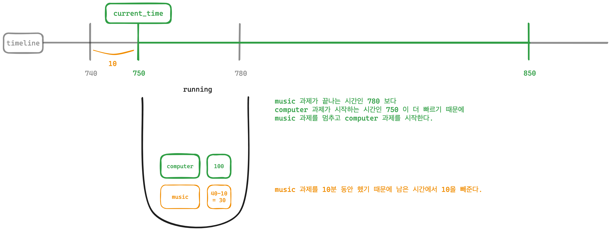
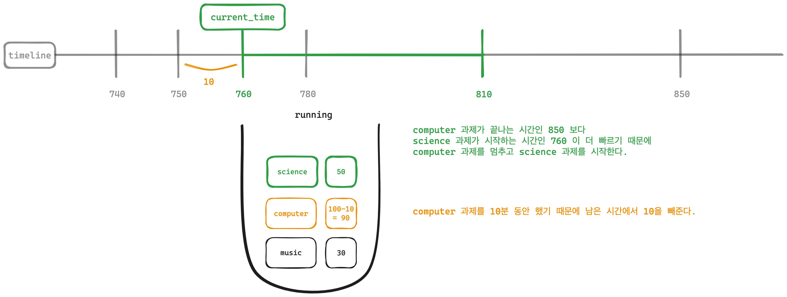
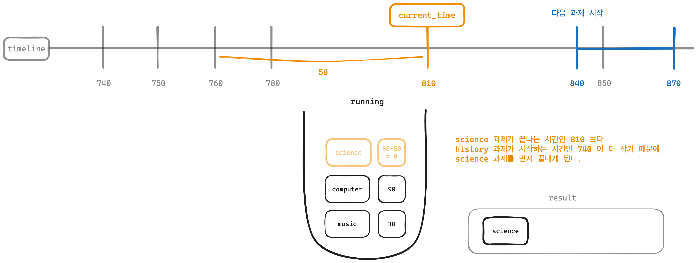
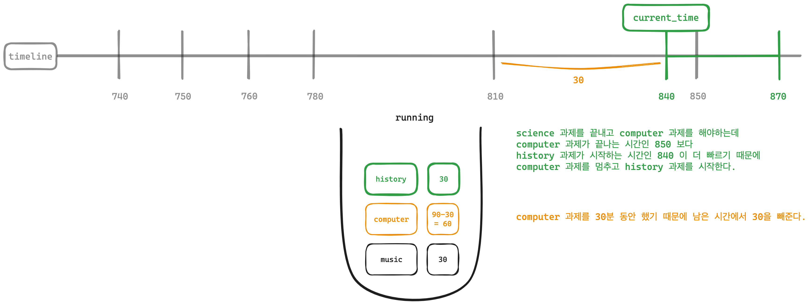
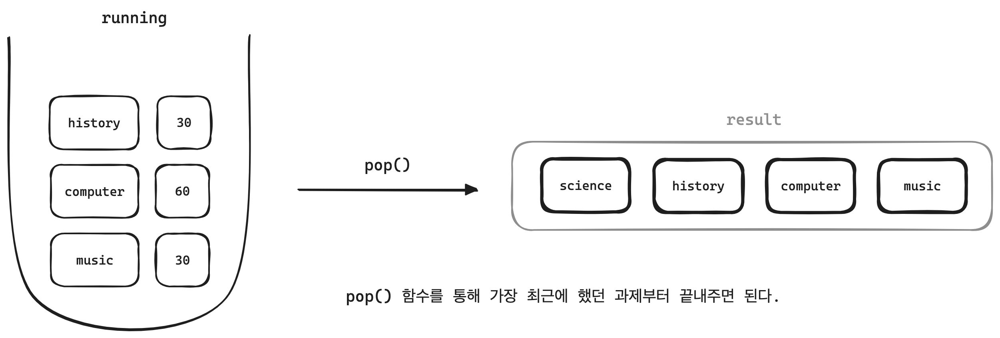

## 문제 링크
https://school.programmers.co.kr/learn/courses/30/lessons/176962 

<br>

## 문제 요약

과제를 하기 위한 계획을 세웠다. `plans` 라는 리스트가 주어지고 리스트의 원소로 `과제 이름(name)`, `시작 시간(start)`, 과제를 하는데 `걸리는 시간(playtime)` 을 가지는 리스트가 주어진다.
그리고 계획에 주어진 과제를 진행하면서 조건에 맞게 우선 순위를 정해서 진행하려고 한다.  

문제에서 과제를 하기 위한 조건은 다음과 같이 제시하고 있다.  

- 과제는 시작하기로 한 시각이 되면 시작한다.  
- 새로운 과제를 시작할 시각이 되었을 때, 기존에 진행 중이던 과제가 있다면 진행 중이던 과제를 멈추고 새로운 과제를 시작한다. 
- 진행중이던 과제를 끝냈을 때, 잠시 멈춘 과제가 있다면, 멈춰둔 과제를 이어서 진행한다.  
  - 만약, 과제를 끝낸 시각에 새로 시작해야 되는 과제와 잠시 멈춰둔 과제가 모두 있다면, 새로 시작해야 하는 과제부터 진행한다. 
  - 멈춰둔 과제가 여러 개일 경우, 가장 최근에 멈춘 과제부터 시작한다. 

간단하게 정리해보면 시간이 되면 과제를 시작하고 하고 있는 과제가 끝나지 않았는데 다른 과제를 해야하면 하던 과제를 멈추고 다음 과제를 한다.
마지막 과제를 마치고 나서 하지 못한 과제 중에서 가장 최근에 멈춘 과제부터 진행한다.  

<br>

## 문제 풀이

먼저 시간 순서대로 과제를 해야하는데 `plans` 라는 리스트가 시간 순으로 정렬되어있지 않아 시간 순서대로 정렬을 먼저 해주었다.

```python
plans.sort(key=lambda x: x[1])
```

다음 진행중인 과제를 저장할 리스트와 현재 시간 변수를 만들어준다.  

```python
running = []  # 진행 중인 일정들을 저장할 스택
current_time = 0  # 현재 시간
```

그리고 계획에 있는 과제들을 가져와서 시각을 분으로 바꿔준 이유는 `콜론(:)` 으로 시와 분이 구분되어있어 처리가 어렵다고 판단이 되었기 때문에 `분` 으로 변환해주었다.  


```python
for plan in plans:
    name, start, playtime = plan
    
    # 시간을 분으로 변환
    start = int(start[:2]) * 60 + int(start[3:])  
    playtime = int(playtime)
```

과제할 시간이 되면 과제를 하나씩 진행하면 되는데 처음에는 진행중인 과제가 없기 때문에 스택에 과제를 넣어준다.  
그리고 현재 시간은 과제를 시작한 시간이 된다.  

다음 과제가 들어왔을 때 현재 진행중인 과제가 아직 끝나지 않았다면 현재 진행하고 있는 과제의 남은 시간에서 현재 지나간 시간을 제외해주고 과제를 멈춘다.  
그리고 새로운 과제를 스택에 넣어준다. 이때, 스택이기 때문에 가장 최근에 들어간 과제가 현재 진행중인 과제라고 생각해야 한다.  

```python
# 스택에 남은 일정의 남은 시간을 업데이트
if running:
    running[-1][1] -= (start - current_time)

# 새로운 일정 스택에 추가
running.append([name, playtime])
current_time = start
```

만약, 진행 중인 과제가 다음 과제를 시작하기 전에 끝이 난다면 과제를 끝내고 과제 이름을 결과에 넣어준다.  

```python
# 스택에 있는 일정 처리
while running and current_time + running[-1][1] <= start:
    last_name, last_playtime = running.pop()
    current_time += last_playtime
    answer.append(last_name)
```

계속해서 과제를 끝내거나 새로운 과제를 시작할 때 현재 시간을 업데이트 해주어야 하고 과제를 멈추었다면 지나간 시간을 빼주어야 한다.  
앞서 코드를 쪼개가면서 설멍해보았는데 설명으로만 본다면 정말 쉽게 느껴지지만 이러한 과정을 직접 코드로 작성하는 데 있어 많이 고민하고 작성했던 것 같다.  

조금 더 이해하기 예제를 통해 쉽게 그림으로 설명하면 좋을 것 같아서 그려보았다.  
그림에서 사용한 예는 다음과 같다. 

```python
plans = [
    ["science", "12:40", "50"], 
    ["music", "12:20", "40"], 
    ["history", "14:00", "30"], 
    ["computer", "12:30", "100"]
]	

result = ["science", "history", "computer", "music"]
```

먼저 시각 순으로 정렬하고나서 분으로 변경해주면 다음과 같이 변경된다.  

  


이제 하나씩 시뮬레이션을 돌려보자.  

첫 과제인 `music` 을 시작할 때에는 현재 진행중인 과제가 없었기 때문에 진행중인 리스트에 과제를 넣어주고 현재 시간을 과제가 시작한 날짜로 만들어준다.  

  

<br>

다음 과제인 `computer` 를 시작해야하는데 아직 `music` 과제가 끝나지 않았기 때문에 `music` 과제를 멈추고 `computer` 과제를 시작한다.  
그리고 10분동안 `music` 과제를 했기 때문에 남은 시간에서 10분을 빼주어야 한다.  




다음도 마찬가지로 `computer` 과제를 끝내기 전에 `science` 과제를 먼저 시작해야하기 때문에 `computer` 과제를 멈추고 `science` 과제를 시작한다.
이때에도 10분동안 `computer` 과제를 했기 때문에 남은 시간에서 10분을 빼주어야 한다.  



그리고 다음 과제인 `hisotry` 과제를 시작하기 전에 `science` 과제가 먼저 끝나게 된다.  
이때 현재 시간은 `science` 과제가 끝나는 시간이 되고 이전에 멈춘 `computer` 과제를 마저 진행한다.  



그럼 과제가 끝난 결과에 추가를 시켜주면 된다.  

`science` 과제를 끝내고 그 전에 멈추었던 `computer` 과제를 하는데 끝내기 전에 `history` 과제를 먼저 시작해야하기 때문에 `history` 과제를 시작한다.  
이때에도 30분동안 `computer` 과제를 했기 때문에 남은 시간에서 30분을 빼주어야 한다.  



이제 더 이상 남아있는 과제가 없기 때문에 가장 최근에 멈추었던 과제부터 하나씩 끝내주면 된다.  



<br>

이러한 과정을 거쳐 조건에 맞게 과제를 마무리할 수 있다.  

거의 3주? 만에 알고리즘 문제를 다시 들여다본 것 같은데 어떻게 보면 조금만 더 집중해서 생각해봤다면 빠른 시간 안에 충분히 풀 수 있었던 문제라고 생각하는데 오랜만에 알고리즘 문제를 풀다보니 감을 많이 잃은 것 같기도 하다.
어떻게 순서를 처리해줄 것인지에 대한 문제와 시간을 어떻게 업데이트 시켜주고 비교를 해줄지 그리고 스택으로 어떻게 처리해주면 좋을지에 대해서 많은 고민이 필요했던 문제였던 것 같다.
그리고 확실히 그림으로 그려가면서 하면 이해가 쉽긴하지만 코딩 테스트를 볼 때에도 그림을 매번 그려가며 풀 수 없기 때문에 조금 더 생각하는 연습을 해봐야겠다.  

아직은 긴 문제를 이해하고 코드로 작성하는 과정에서 많이 부족하다고 느꼈고 시간이 날 때마다 하나씩 꾸준히 풀어봐야겠다.  

<br>

## 제출 답안

```python
def solution(plans):
    answer = []
    # 입력 데이터 전처리: 시작 시간 기준으로 정렬
    plans.sort(key=lambda x: x[1])
    
    running = []  # 진행 중인 일정들을 저장할 스택
    current_time = 0  # 현재 시간
    
    for plan in plans:
        name, start, playtime = plan
        
        # 시간을 분으로 변환
        start = int(start[:2]) * 60 + int(start[3:])  
        playtime = int(playtime)
        
        # 스택에 있는 일정 처리
        while running and current_time + running[-1][1] <= start:
            last_name, last_playtime = running.pop()
            current_time += last_playtime
            answer.append(last_name)
        
        # 스택에 남은 일정의 남은 시간을 업데이트
        if running:
            running[-1][1] -= (start - current_time)
        
        # 새로운 일정 스택에 추가
        running.append([name, playtime])
        current_time = start
    
    # 스택에 남은 일정 처리
    while running:
        answer.append(running.pop()[0])
    
    return answer
```