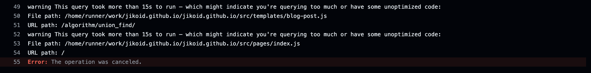
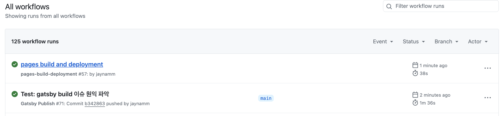
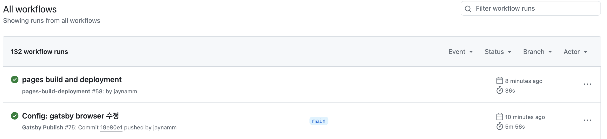

## 문제 확인하기  

Gatsby 를 통해 포스트를 작성하고나서 배포하려고 하는데 Github Action 에서 Workflow 를 실행할 때 build 하는 부분에서 계속 멈춰서 진행되지 않는 문제가 생겼다.  
분명 이전까지 잘 되었는데 포스트를 배포하려고 하니 github 페이지에 배포가 되지 않았다.  

그래서 Workflow 내에서 단계별로 나누어서 다시 실행해보았는데 정확히 `gatsby build` 하는 부분에서 멈춰서 진행되지 않는 것을 확인했다.  
실행 시간을 확인해보아도 6시간 후에 실패한 것으로 보인다. 이 시간은 Github Actions 의 기본 타임아웃이 360분으로 설정되어있어서 타임아웃이 발생하면서 멈춘 것으로 보인다.    

<br>


<br>

그리고 아래의 사진과 같이 Gatsby Build 하는 부분에서 실패한 것을 확인했다.  


<br>

그래서 왜 에러가 발생했는지 확인해보는데 자세한 에러가 나와있지 않았다.  



<br>

아래는 raw logs 이다.  

```shell
2024-07-17T16:17:56.3478114Z ##[error]The operation was canceled.
2024-07-17T16:17:56.3558713Z Post job cleanup.
2024-07-17T16:17:56.4488198Z [command]/usr/bin/git version
2024-07-17T16:17:56.4523969Z git version 2.45.2
2024-07-17T16:17:56.4564834Z Temporarily overriding HOME='/home/runner/work/_temp/3485a515-905c-437b-a6d8-4b1a97b4bb6a' before making global git config changes
2024-07-17T16:17:56.4566127Z Adding repository directory to the temporary git global config as a safe directory
2024-07-17T16:17:56.4576313Z [command]/usr/bin/git config --global --add safe.directory /home/runner/work/jikoid.github.io/jikoid.github.io
2024-07-17T16:17:56.4609329Z [command]/usr/bin/git config --local --name-only --get-regexp core\.sshCommand
2024-07-17T16:17:56.4640183Z [command]/usr/bin/git submodule foreach --recursive sh -c "git config --local --name-only --get-regexp 'core\.sshCommand' && git config --local --unset-all 'core.sshCommand' || :"
2024-07-17T16:17:56.4890400Z [command]/usr/bin/git config --local --name-only --get-regexp http\.https\:\/\/github\.com\/\.extraheader
2024-07-17T16:17:56.4911846Z http.https://github.com/.extraheader
2024-07-17T16:17:56.4924351Z [command]/usr/bin/git config --local --unset-all http.https://github.com/.extraheader
2024-07-17T16:17:56.4957198Z [command]/usr/bin/git submodule foreach --recursive sh -c "git config --local --name-only --get-regexp 'http\.https\:\/\/github\.com\/\.extraheader' && git config --local --unset-all 'http.https://github.com/.extraheader' || :"
2024-07-17T16:17:56.5421392Z Cleaning up orphan processes
2024-07-17T16:17:56.5732806Z Terminate orphan process: pid (1976) (npm run build)
2024-07-17T16:17:56.5773323Z Terminate orphan process: pid (1987) (sh)
2024-07-17T16:17:56.5799989Z Terminate orphan process: pid (1988) (node)
2024-07-17T16:17:56.5830657Z Terminate orphan process: pid (2046) (node)
2024-07-17T16:17:56.5881491Z Terminate orphan process: pid (2103) (chrome)
2024-07-17T16:17:56.5934322Z Terminate orphan process: pid (2105) (chrome_crashpad_handler)
2024-07-17T16:17:56.6040627Z Terminate orphan process: pid (2190) (chrome)
2024-07-17T16:17:56.6094050Z Terminate orphan process: pid (2192) (chrome_crashpad_handler)
2024-07-17T16:17:56.6144485Z Terminate orphan process: pid (2194) (chrome_crashpad_handler)
2024-07-17T16:17:56.6228338Z Terminate orphan process: pid (2278) (chrome)
2024-07-17T16:17:56.6280568Z Terminate orphan process: pid (2280) (chrome_crashpad_handler)
2024-07-17T16:17:56.6331837Z Terminate orphan process: pid (2282) (chrome_crashpad_handler)
```

<br>

## 문제 원인 파악하기  

문제가 발생한 시점을 보면 포스트를 작성한 시점 이전에는 배포가 잘 되었는데 포스트를 배포하려고 하니 build 가 되지 않았다.  
그래서 여러 경우를 테스트해보면서 어떤 부분에서 문제가 있었는지 찾아보려고 한다.  


### 문제가 발생하기 전 상태로 되돌리기  

포스트를 작성하고 배포하기 전까지는 빌드가 잘 되었기 때문에 포스트를 제외하고 이전으로 돌아가서 빌드가 잘 되는지 시도해보았다.  
포스트의 이름을 변경하고나서 기존에 있던 파일이 삭제된 것으로 보이기 때문에 변경된 포스트를 제외하고 기존의 포스트가 제거된 내용만 커밋하고 merge 시켜주었다.  

<br>



<br>

위의 사진과 같이 포스트만 제거했는데 배포가 제대로 되었다... 왜지...?

일단은 포스트때문에 문제가 생기는 것은 확인했다. 그래서 포스트를 빌드하는 과정에서 문제가 발생한다고 생각이 들었고 나는 이 포스트를 배포하고 싶었기 때문에 포스트를 배포하기 위해서 어떤 설정을 해주어야 하는지 찾아보았다.  

<br>

### 배포할 때 변경된 포스트만 빌드해보기  

Gatsby 기능 중 하나로 빌드할 때 `GATSBY_EXPERIMENTAL_PAGE_BUILD_ON_DATA_CHANGES` 의 값을 `true` 로 설정하게 되면 데이터 변경 시에만 페이지를 다시 빌드하도록 설정할 수 있다고 한다. 따라서 빌드 시간을 크게 줄일 수 있다.  
이 기능을 설정항 이유가 전체 포스트를 다시 빌드하게 되면서 발생한 문제이지 않을까? 하는 생각에 설정해주고 테스트를 해보았다.  

github action workflow 에서 다음과 같이 gatsby build 과정에서 env 를 설정해주었다.  

```shell
- name: Build Gatsby
  run: npm run build
  env:
    GATSBY_EXPERIMENTAL_PAGE_BUILD_ON_DATA_CHANGES: true # Enable incremental builds
```

빌드가 제대로 되지 않는 것 같다.  

그래서 로그를 들여다보니 쿼리를 가져오는 과정에서 오래걸리는 게 문제가 되는 것일까 하는 생각이 들었다.  

```shell
warning This query took more than 15s to run — which might indicate you're querying too much or have some unoptimized code:
File path: /home/runner/work/jikoid.github.io/jikoid.github.io/src/templates/blog-post.js
URL path: /algorithm/what_is_union_find/
warning This query took more than 15s to run — which might indicate you're querying too much or have some unoptimized code:
File path: /home/runner/work/jikoid.github.io/jikoid.github.io/src/pages/index.js
```

그래서 관련된 부분에 대해서 찾아보았지만 딱히 해결 방법은 찾지 못했다.  

<br>

### 기존에 추가했던 Plugin 살펴보기  

그래서 혹시 기존에 추가했던 플러그인 문제가 있는건 아닌지 `gatsby-config.js` 파일을 살펴보았다.  

하나씩 살펴보던 중에 문제의 원인을 찾았다!!!  

문제가 된 플러그인은 얼마 전에 링크 미리보기 기능을 넣고 싶어서 추가했던 `gatsby-remark-link-preview` 이었다.  

이 플러그인은 링크 위에 마우스를 올리면 미리보기 화면을 보여주는 모듈인데 정확히 어떤 부분때문에 문제가 발생하는지는 찾지 못했지만 어떤 모듈인지 다시 살펴보았다.  
repository 를 확인해보니 star 5개.. 그리고 3년 전 업데이트된 이후로 제대로 업데이트가 되지 않은 것을 볼 수 있었다.  

결국에는 지속적으로 업데이트되지도 않았고 제대로 동작하는지 검증되지도 않은 플러그인을 사용하다보니 이런 문제가 발생했던 것 같다.  

따라서, 해당 플러그인과 관련된 부분을 모두 제거해주니 정상적으로 배포가된 것을 확인할 수 있었다.  

<br>



<br>

## 정리

결국 이 문제는 제대로 알아보지 않고 사용한 플러그인때문에 발생한 문제였다.  

로컬에서는 빌드가 정상적으로 되었는데 Github 페이지에 배포하려고 하니 빌드가 끝나지 않고 멈춘 상태로 되었고 제대로 배포가 되지 않았다. 다음부터 플러그인을 추가할 때 업데이트가 지속적으로 이루어지고 있는지 그리고 사용했을 때 이슈는 없는지와 같이 꼼꼼히 살펴보고 사용해야한다는 것을 많이 느꼈다.  

그래도 문제가 해결되어 다행이다...!  