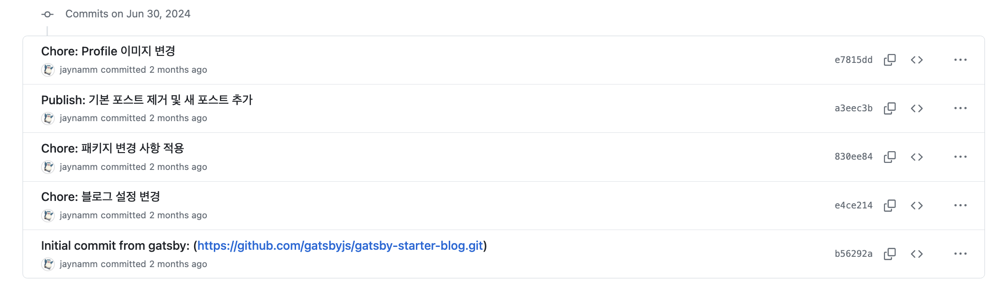
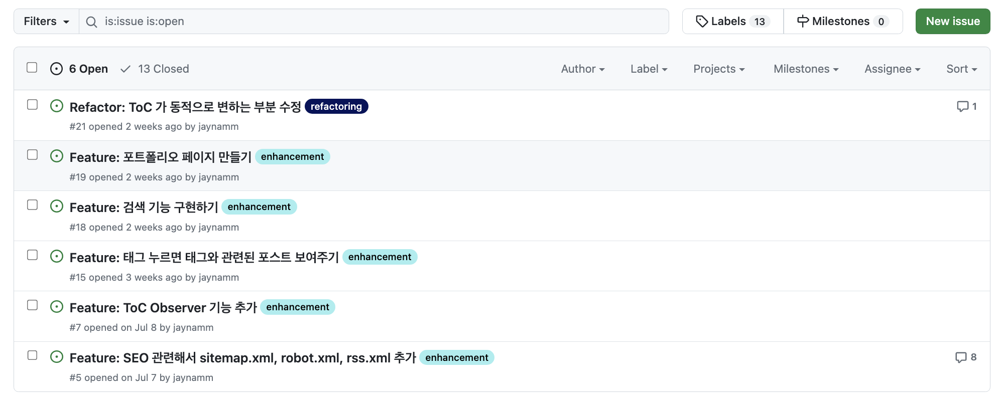

## 블로그를 시작한지 

Gatsby 블로그 스타터를 사용해서 만들기 시작한지 벌써 두 달이 지났다. 처음 커밋한 날짜를 확인해보니 6월 30일에 처음 커밋을 했다고 나온다.  

처음에는 티스토리 블로그 말고 내 블로그를 만들자고 시작했었는데 이제는 완전히 Gatsby 블로그를 중점으로 포스팅하고 있다.  

그래서 지금까지 어떤 기능을 추가했고 어떤 어려움이 있었는지 정리해보려고 한다.  

 

## 추가한 기능들

내가 지금까지 두 달 동안 블로그에 어떤 기능들을 추가했고 어떤 작업들을 했는지 나열해봤다.  

- 블로그 설정 변경과 기본 프로필 변경 그리고 시간 포맷 변경하기  
    - KST 시간과 날짜를 보기 쉽게 변경했다.  
- 포스트에 태그 리스트 표시하기  
    - frontmatter 에 나열한 태그를 포스트 리스트에서 보여주려고 했다.  
- Github 에 배포할 수 있게 Github Actions 추가하기  
    - 수동으로 빌드 해주지 않고 자동으로 github 에 배포하려고 스크립트를 생성했다.  
- 카테고리 기능 추가하기  
    - 카테고리를 frontmatter 에 추가하면 카테고리 페이지를 만들어서 카테고리에 있는 포스트를 보여주려고 했다.  
- SEO 를 위한 sitemap.xml, rss.xml, robots.txt 설정하기  
- CSS 스타일 정리하고 커스텀하기  
    - scss 로 전부 변경했다.  
- TableOfContent 기능 추가하기  
    - 포스트에서 header 를 기준으로 컨텐츠 순서를 표시했다.  
- 프로필에 소셜 링크 추가하기  
    - github, tistory, linkedin 링크를 추가했다.  
- 컴포넌트 정리하기  
    - 컴포넌트를 폴더로 정리하고 index.js 파일로 만들어주었다.  
- 포스트 댓글 기능 추가하기 (utterances)  
    - 사람들이 자주 사용하는 utterances 를 사용해서 댓글 기능을 추가했다.  
- 코드 블럭 커스텀하기     
    - 코드를 알아보기 쉽게 스타일을 변경했다.  
- 카테고리 path 정리하기  
    - URL Path 가 일치하도록 설정해주었다.  
- Layout 변경하기  
    - 카테고리를 추가하게 되면서 레이아웃을 변경했다.  
- headroom 추가해서 카테고리 보여주기  
    - 모바일 화면에서 카테고리를 보여주고 싶어 만들었다.  
- 포스트 날짜와 읽는 시간에 아이콘 추가하기  
    - 조금 더 UI 적으로 꾸미고 싶어서 아이콘을 넣어주었다.  
- 댓글 기능 변경하기  
    - utterances 에서 giscus 로 변경했다.  
- 다크 모드 기능 추가하기  
    - Toggle 스위치에 애니메이션 추가하기

 

## 많은 시행착오 

나는 프론트엔드 개발자도 아니고 프론트엔드 개발 지식도 React 조금? 그리고 html, css 기본적인 부분들? 만 알고있었기 때문에 생각보다 이해하지 못하고 추가한 기능들도 꽤 있다.  

그래도 열심히 다른 사람들이 만든 과정을 참고해가며 만들었고 다른 사람들이 만든 블로그 repository 에 가서 코드를 하나씩 보면서 내 블로그에 맞게 옮기면서 블로그를 만들어갔던 것 같다.  

 

### 정말 어려웠던 카테고리 기능 

카테고리 기능을 추가하는 데 정말 많은 시행착오를 거쳤던 것 같다. 처음에는 여기저기 블로그들을 찾아보면서 그대로 복사, 붙여넣기 해서 되는지 확인해보고 했었는데 카테고리가 만들어지는 과정을 이해하지 못했으니 당연히 될리가 없었다....   
그렇게 며칠을 만들고 다시 원복하고를 반복하다가 어떤 블로그를 발견해서 결국에는 카테고리를 만드는 과정을 이해하면서 카테고리를 추가했던 기억이 난다.  

정말 이 블로그가 아니었다면 만들지 못햇을 것이다.  

[카테고리 기능을 추가할 때 참고한 블로그](https://ohseunghyeon.github.io/blogging/making-category-page/)  

`gastby-node.js` 에서 graphql 을 통해 데이터를 가져오고 `template` 을 통해 페이지를 생성하고 `template` 을 통해 만든 페이지에 컴포넌트들을 추가해서 하나의 페이지를 만드는 과정을 이해하는데 많은 시간이 걸렸던 것 같다.  

어찌저찌 카테고리 페이지를 만들어서 추가했고 왼쪽 사이드에 사이드바를 만들어서 네비게이션이 되도록 하는데까지 거의 2~3주는 걸렸던 것 같다. 
정말 위에서 말한 블로그의 Git Repository 에 있는 코드들을 하나씩 분석해가면서 내 블로그에 맞게 카테고리를 만드는데 정말 힘들게 만들었던 것 같다.  

그리고 나중에 만들고보니 카테고리가 어떤 것은 한글이고 어떤 것은 영어로 되어있어서 영어로 통일해서 한글로 파싱해주는 작업을 해야했고 폴더 이름이 그대로 url path 가 되기 때문에 frontmatter 에 적어주는 category 와 똑같이 만들어주었다.
그래야 카테고리 페이지에서 포스트를 클릭해서 들어갈 때 카테고리 url 은 그대로 있고 뒤에 포스트 path 가 붙으면서 자연스럽게 페이지가 이동되는 것처럼 보여주기 때문이었다.  

- 변경 전 URL (URL 이 달랐던 이유는 카테고리 이름과 포스트를 작성한 폴더 이름이 달랐기 때문)
    - 카테고리 페이지 URL : `https://jikoid.github.io/algorithm/leetcode`
    - 포스트 페이지 URL : `https://jikoid.github.io/problem-solving/leetcode/포스트이름`
- 변경 후 URL
    - 카테고리 페이지 URL : `https://jikoid.github.io/algorithm/leetcode`
    - 포스트 페이지 URL : `https://jikoid.github.io/algorithm/leetcode/포스트이름`

이런 저런 손봐야하는 부분들을 열심히 고쳐주고 다듬어주고 진짜 힘들게 카테고리를 추가하고나니 상상하지 못할 뿌듯함이 ㅎㅎㅎ

 

### 알다가도 모를 sitemap 생성하기  

아직까지도 제대로 한 건지 알 수 없는 stiemap 만들기...  
처음에는 sitemap 을 아무리 변경해도 적용이 되지 않길래 왜 안되지 했었는데 어떤 글에서 public 에 있는 파일을 제거해주어야 한다고 하더라...  
그렇게 clean 명령어를 통해 빌드한 파일을 제거해주고 다시 빌드하니 제대로 생성되었던 기억이 난다.  

나는 Gatsy v5 을 사용하고 있는데 이전에는 stiemap.xml 파일이 잘 만들어졌었는데 v5 버전이 되고 sitemap 이 제대로 생성되지 않는건지 몰라도 어떤 것을 통해 sitemap 을 만들어야 하는건인가 하는 고민에 빠졌다.  

찾아보니 2개의 plugin 이 있었는데... 둘 중 어느 것을 사용해서 만들어야 하는지도 잘 모르겠다.  

- gatsby-plugin-sitemap
- gatsby-plugin-advanced-sitemap-v5

`gatsby-plugin-sitemap` 을 사용해서 만들면 `sitemap-index.xml` 파일이 만들어지고 그 안에 `sitemap-0.xml` 파일이 만들어지는데 파일 제한 때문에 인덱싱해서 파일을 0부터 나누어서 만든다는 것은 이해했는데 
구글 서치 콘솔에서 제대로 인식하는지 잘 모르겠다.  

그리고 `gatsby-plugin-advanced-sitemap-v5` 를 사용해서 만들면 `stiemap.xml` 파일이 만들어지고 그 안에 `sitemap-pages.xml` 에 URL path 리스트가 보이는데 이것도 제대로 적용되는 것인지 알 방법이 없다.  

그래서 먼저 `gatsby-plugin-advanced-sitemap-v5` 를 사용해서 sitemap 을 만들어서 구글 서치 콘솔에 제출했더니 페이지는 제대로 잡히는 것 같은데 색인 생성이 제대로 되지 않는다.
심지어 2주 정도 지나 그제서야 페이지를 인식하기 시작했고 색인 검사 대기열에 올렸지만 해당사항 없다고만 나오고 제대로 색인 생성이 되지 않는 것 같았다.  

그래서 지금은 `gatsby-plugin-sitemap` 를 사용해서 stiemap 을 생성해서 다시 제출한 상태고 2~3주 정도 지켜볼 예정이다.  

도대체 어떻게 stiemap 을 생성해서 제출해야하는지 알 수가 없다... 그래서 일단 기다려보고 결과를 확인해보려고 한다.  

 

### 노가다의 끝판왕 다크 모드 

다크 모드를 만드는 것까지는 수월했다. 하지만 모든 scss 파일 안에 다크모드를 위한 css 를 한 번 더 작성해주어야 했다. 
일일이 확인해가면서 제대로 변경되었는지도 확인해야 했고 color 를 수동으로 설정해준 부분은 다크 모드일 경우에도 수동으로 색을 정해주어야 해서 그냥 제거해버린 것도 있다.
왜냐면 color 를 제거하게 되면 자동으로 색이 반전되어 보여진다.  

그래도 생각보다 쉽게 다크 모드를 적용하고 나서 보니 한 가지 빼먹은 것이 있었다.  

utterances 댓글도 다크 모드로 변환이 되어야 했다. 하지만 script 로 생성하고 있었기 때문에 script 의 속성을 변경해주어야 하는데 계속해서 에러가 발생했다.  

그래서 결국에는 utterances 말고 giscus 로 댓글 기능을 변경하게 되었다. react 모듈로 만들 수 있어서 쉽게 다크모드를 적용할 수 있었고 또 댓글에 댓글을 다는 기능도 있어서 오히려 잘 바꾸었다고 생각한다.  

다크 모드를 만들 때 이 블로그를 정말 많이 참고했다.  

[다크 모드를 적용할 때 참고했던 블로그](https://klloo.github.io/darkmode/)  

그리고 다크 모드를 전환하기 위해서 토글 버튼이나 스위치를 만들어야 하는데 어떤 분이 애니메이션으로 너무 예쁘게 만들어서 나도 열심히 찾아서 비슷하게나마 만들어보았다.  

나름... 만족이랄까?ㅎㅎㅎ  

 

### 이거 말고도...  

css 를 변경해야하는데 정말 너무 노가다더라... 프론트 엔드 아무나 하는 거 아니야... ㅎㅎ  
css 를 적용하는 과정에서도 어떤 분은 style-components 라이브러리를 사용해서 하시는 분도 계셨고 어떤 분은 emotion 을 사용하고 각자 취향에 맞게 스타일 코드를 작성해주고 계셔서 
나는 어떻게 스타일을 잘 구분해서 적용해줄 수 있을지 고민하다가 scss 를 사용해서 각 컴포넌트마다 스타일을 따로 적용해주어야 겠다고 생각했다.  
그래서 하나로 합쳐져있는 css 파일을 각 컴포넌트 별로 나누어서 scss 파일로 다시 작성해주고 적용해주었다.  

이거 말고도 정말 많은 시행착오를 거치고 정말 많은 에러를 보면서 하나씩 고쳐나갔던 것 같다.  

 

## 중간 점검 마무리 그리고 할 일

여기까지 내가 그동안 블로그를 만들면서 했던 내용들을 적어봤는데 이것 말고도 아직 추가해야할 기능들이 많이 남아있다.  

  

이렇게 추가하고 싶은 기능들을 다 이슈에 적어놓았는데 많더라...  

앞으로 조금씩 조금씩 기능들을 추가할 예정이고 공부하면서 잘 정리해서 포스팅할 예정이다.  

내가 직접 블로그를 만들겠다고 다짐하고 바로 블로그를 만들게 되었는데 처음에는 Jekyll 을 사용해서 만드려고 하다가 하나부터 열까지 수작업으로 다 만들어주어야 하고 불편한 점이 많아 Gatsby 로 다시 만들게 되었다.  

지금까지 만들어진 내 블로그를 보니 나름 뿌듯하기도 하고 이정도면 처음 만드는 것치고 열심히 만들었다 싶다! ㅎㅎ  

지금까지 꾸준히 했던 것처럼 앞으도로 꾸준히 공부하고 공부한 내용 정리해서 블로그에 올려서 공유하고 계속해서 이어나가봐야 겠다.  

천천히 그리고 꾸준히!  