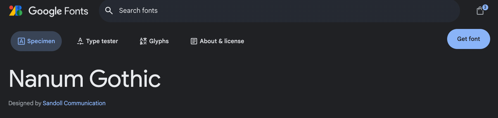
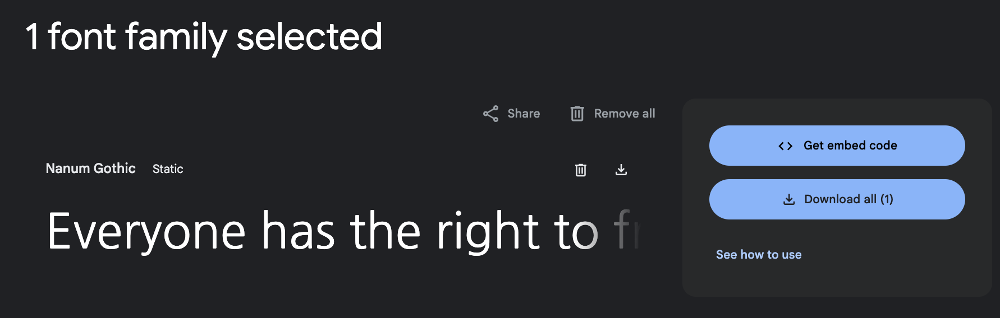
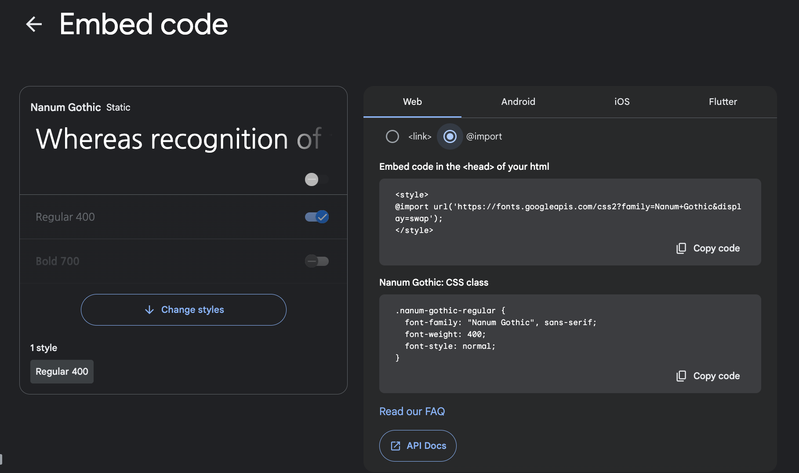

이번에는 Github 블로그에 한글 폰트를 적용해보려고 한다.  
  
  

##  구글 웹 폰트 import 하기

먼저 구글에서 사용할 font 를 찾아서 improt 해야 한다.  
아래의 사이트에서 폰트를 검색할 수 있다.

https://fonts.google.com/?subset=korean&noto.script=Kore


원하는 폰트를 위의 사이트에서 검색하고나서 클릭해서 상세 정보를 확인해보면 아래의 사진과 같이 상단에 `Get font` 가 보인다.

 

<br>

`Get font` 를 클릭해서 들어가면 아래와 같이 나오게 되는데 `Get embed code` 를 누른다.

<br>



<br>

다음으로 Web Tab 에서 `Web` 과 `@import` 선택을 할 수 있는데 `@import` 를 선택한다.  



<br>

그럼 `@import` 할 수 있는 코드를 제공해주는데 해당 코드를 복사한다.

```html
@import url('https://fonts.googleapis.com/css2?family=Nanum+Gothic&display=swap');
```

<br>

이렇게 복사한 코드를 `assets/css/main.scss` 파일에 복사해준다. 


```html
---
# Only the main Sass file needs front matter (the dashes are enough)
search: false
---

@charset "utf-8";

@import "minimal-mistakes/skins/{{ site.minimal_mistakes_skin | default: 'default' }}"; // skin
@import "minimal-mistakes"; // main partials

// Font 변경
@import url('https://fonts.googleapis.com/css2?family=Nanum+Gothic&display=swap');
```

마지막으로 블로그의 font 가 변경되었는지 확인한다.
