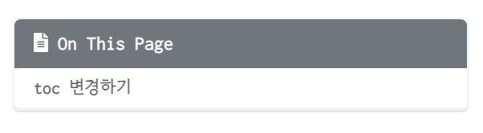
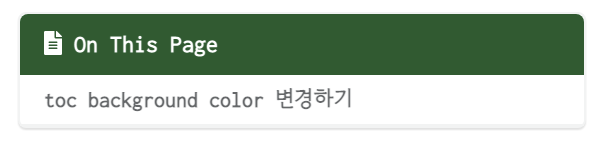

이번에는 Github 블로그에 toc를 변경해보려고 한다.  
<br><br>

## toc background color 변경하기
<br>

먼저 toc 의 background color를 변경해보려고 한다.    

toc의 background color 가 어디에서 설정되어있는지 확인해보니 `_sass/minimal-mistakes/_navigation.scss` 에서 설정되어있는 것을 확인할 수 있다.  

아래로 내리다 보면 `.toc` 아래에 있는 `.nav__title` 부분을 볼 수 있는데 여기서 background 값을 변경하면 된다.  

```scss
.nav__title {
color: #fff;
font-size: $type-size-6;
background: $primary-color;    << 변경
border-top-left-radius: $border-radius;
border-top-right-radius: $border-radius;
}
```

따라서 확인해보면 background 의 값이 `$primary-color` 의 변수로 되어있어 확인해보니 `_sass/minimal-mistakes/_variables.scss` 에서 `$primary-color` 의 값을 확인할 수 있다.  

```scss
$primary-color: #6f777d !default;  << background 값으로 설정되어있는 color
$success-color: #3fa63f !default;
$warning-color: #d67f05 !default;
$danger-color: #ee5f5b !default;
$info-color: #3b9cba !default;
$focus-color: $primary-color !default;
$active-color: mix(#fff, $primary-color, 80%) !default;
```
<br>

그럼 `$primary-color` 의 값을 변경하면 되는데 나는 별도로 변수를 하나 생성해서 toc title 에서 쓰일 값을 생성해주었다.  


```scss
$toc-title-color: #205b2c !default;
```

<br>

그리고 `_sass/minimal-mistakes/_navigation.scss` 에서 `$primary-color` 대신 `$toc-title-color` 로 변경해주면 된다.  

```scss
.nav__title {
    color: #fff;
    font-size: $type-size-6;
    background: $toc-title-color;  << 변경 완료
    border-top-left-radius: $border-radius;
    border-top-right-radius: $border-radius;
  }
```

<br>

자 그럼 변경된 결과를 확인해보자.  

- 변경 전  

<div style="padding: 0 200px;">
  
</div>

<br>

- 변경 후  

<div style="padding: 0 200px;">
  
</div>

<br>

이렇게 toc 를 커스텀해서 사용할 수 있다.  
