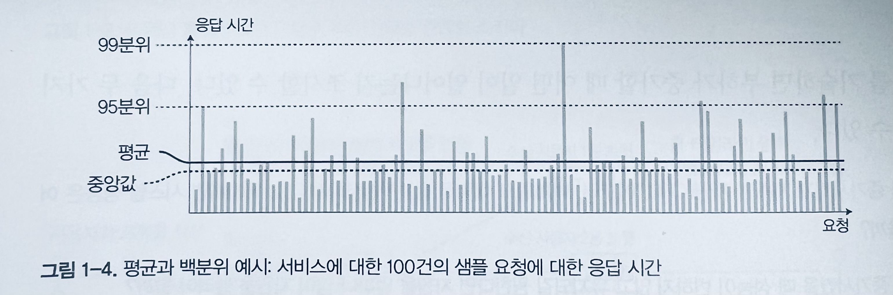

이번에는 신뢰성에 이어  `확장성` 에 대한 내용을 정리해보려고 한다.  

<br>

## 확장성 (Scalability)  

시스템이 현재 안정적으로 동작한다고 해서 미래에도 안정적으로 동작한다는 보장은 없다. 성능 저하를 유발하는 흔한 이유 중 하나는 `부하 증가` 이다.
어쩌면 시스템의 동시 사용자 수가 1만 명에서 10만 명 또는 100만 명으로 증가했을 수도 있다. 시스템은 전에 처리했던 양보다 더 많은 데이터를 처리하고 있을지도 모른다.  

`확장성`은 증가한 부하에 대처하는 시스템 능력을 설명하는데 사용하는 용어지만 시스템에 부여하는 일차원적인 표식이 아님을 주의하자.  

<br>

### 부하 기술하기

무엇보다 시스템의 현재 부하를 간결하게 기술해야 한다.  

#### 부하 매개변수

부하는 `부하 매개변수 (laod parameter)` 라 부르는 몇 개의 숫자로 나타낼 수 있다. 가장 적합한 부하 배개변수 선택은 시스템 설계에 따라 달라진다.
부하 매개변수로 웹 서버의 초당 요청 수, 데이터베이스의 읽기 대 쓰기 비율, 대화방의 동시 활성 사용자, 캐시 적중률 등이 될 수 있다.  

#### 트위터 예시

이 책에서는 트위터를 통해 예를 들어가며 부하 매개 변수에 대해서 알려주고 있다.  

트위터에서 다음과 같이 두 가지 동작을 한다.  

1. 트윗(tweet) 작성
    새로운 메시지를 게시하는 기능
2. 홈 타임라인(timeline)
    팔로우한 사람이 작성한 트윗을 볼 수 있는 기능

이렇게 트위터에서 사용하는 두 가지 기능이 있는데 트윗을 작성하는 경우 쉽게 처리가 가능했지만 팬 아웃(fan-out) 때문에 확장성의 문제가 발생한다고 한다.
그 이유는 개별 사용자는 많은 사람을 팔로우하고 많은 사람이 개별 사용자를 팔로우 한다.  

따라서, 이 두 가지 동작을 구현하는 방법은 두 가지로 나눌 수 있다.  

첫 번째 방법으로는,  

- 트윗 작성은 간단하게 새로운 트윗을 트윗 전역 컬렉션에 삽입한다.  
  - 사용자가 자신의 홈 타임라인을 요청하면 팔로우하는 모든 사용자를 찾는다.
    - 모든 사용자의 트윗을 찾아 시간순으로 정렬해서 합친다.
- 트윗과 유저, 팔로우를 조인해서 가져오는 질의를 작성한다.  

이 방법은 말그대로 모든 트윗을 모아 질의를 통해 내 트윗과 팔로우하는 모든 사용자의 트윗을 가져오는 질의를 작성해서 가져오는 방법이다.  

두 번째 방법으로는,   

- 각 수신 사요앚용 트윗 우편함처럼 개발 사용자의 홈 타임라인 캐시를 유지한다.  
- 사용자가 트윗을 작성하면 해당 사용자를 팔로우하는 사람들 모두 찾는다.
  - 팔로워 각자의 홈 타임라인 캐시에 새로운 트윗을 삽입한다.  

두 번째 방법은 각 팔로워들의 홈 타임라인을 캐시로 가지고 있어 새로운 트윗을 캐시에 추가해주는 방법이다.  

트위터의 첫 번째 버전은 첫 번째 방법을 선택했었는데 시스템이 홈 타임라인의 질의 부하를 견뎌내야했고 그 결과 두 번재 방법으로 전환했다고 한다.
새로운 트윗만 캐시에 추가해주면 되기 때문에 읽기 요청량이 적어지기 때문에 훨씬 잘 동작한다. 그래서 이 경우에는 쓰기 시점에서 더 많은 일을 하고 읽기 시점에서 적은 일을 하는 것이 바람직하다.  

하지만 두 번째 방법의 불리한 점은 이제 트윗 작성이 많은 부가 작업을 필요로 한다는 점이다. 즉, 캐시 쓰기 요청량이 많아진다는 점이다.  
또한 일부 사용자의 경우 팔로워가 3천만명이 넘는다. 그럼 홈 타임라인에 3천만 건 이상의 쓰기 요청이 될지도 모른다는 의미다.  

결론적으로 트위터는 두 가지 방법을 혼용해서 사용하는 하이브리드로 바꾸고 있다. 대부분 사용자의 트윗은 계속해서 사람들이 작성할 때 홈 타임라인에 펼쳐지지만 팔로워 수가 매우 많은 소수 사용자는 팬 아웃에서 제외된다. 
사용가작 팔로우한 유명인의 트윗은 별도로 가져와 접근 방식 1 처럼 읽는 시점에 사용자의 홈 타임라인에 합친다. 
이 하이브리드 접근 방식은 좋은 성능으로 지속적인 전송이 가능하다.  

<br>

### 성능 기술하기  

두 가지 방법을 통해 살펴볼 수 있다.  

- 부하 배개변수를 증가시키고 시스템 자원은 변경하지 않고 유지하면 시스템 성능은 어떻게 영향을 받을까?
- 부하 매개변수를 증가시켰을 때 성능이 변하지 않고 유지되길 원한다면 자원을 얼마나 많이 늘려야할까?

두 질문 모두 성능 수치가 필요하다.  

하둡의 경우 일괄 처리 시스템이기 때문에 보통 `처리량(throughput)` 을 확인하고 온라인 시스템의 경우 서비스 `응답 시간(response time)` 을 확인한다.  

```
지연 시간(latency)과 응답 시간(response time) 의 차이

지연 시간은 요청이 처리되길 기다리는 시간, 서비스를 기다리며 휴지(latent) 상태인 시간을 말한다. 
응답 시간은 클라이언트 관점에서 본 시간, 요청을 처리하는 실제 시간 외에도 네트워크 지연 시간과 큐 지연도 포함한다. 
```

클라이언트가 반복해서 동일한 요청을 하더라도 매번 응답 시간이 다르다. 
실제로 다양한 요청을 다루는 시스텡메서 응답 시간은 많이 변한다. 그러므로 응답 시간은 단일 숫자가 아닌 측정 가능한 값의 `분포` 로 생각해야 한다.  



위의 그림에서 회색 막대는 서비스에 대한 요청을 나타내고 막대의 높이는 요청에 소요된 시간을 보여준다.
대부분의 요청을 꽤 빠르지만 가끔 꽤 오래 걸리는 `특이 값(outlier)` 이 있다. 아마도 느린 요청은 더 많은 데이터를 처리하기에 본질적으로 더 비쌀지도 모른다.
하지만 모든 요청에 동일한 시간이 걸려야 한다고 생각하는 상황에도 다양한 값을 얻게 된다.  

보고된 서비스 평균 응답 시간을 살피는 것은 일반적이다. 여기에서 평균이라는 값은 대개 `산술 평균(artihmetic mean)` 으로 이해한다.  
하지만 "전형적인" 응답 시간을 알고 싶다면 평균은 그다니 좋은 지표가 아니다.  

#### 백분위

일반적으로 평균보다는 `백분위(percentile)` 를 사용하는 편이 더 좋다. 응답 시간을 두고 가장 빠른 시간부터 가장 느린 시간까지 정렬하면 중간 지점이 `중간값(median)` 이 된다. 
사용자가 보통 얼마나 오랫동안 기다려야 하는지 알고 싶다면 중앙값이 좋은 지표가 된다. 중앙값은 단일 요청을 참고한다는 점을 주의하자.  

특이 값이 얼마나 좋지 않은지 알아보려면 상위 백분위를 살펴보는 것도 좋다. 이때 사용하는 백분위는 `95분위`, `99분위`, `99.9분위` 가 일반적이다.
위의 사진에 백분위가 표시되어있어 확인할 수 있다.  

#### 꼬리 지연 시간

`꼬리 지연 시간(tail latency)` 으로 알려진 상위 백분위 응답 시간은 서비스의 사용자 경험에 직접 영향을 주기 때문에 중요하다.  

예를 들어, 아마존은 내부 서비스의 응답 시간 요구사항을 99.9분위로 기술한다. 
보통 응답 시간이 가장 느린 요청을 경험한 고객들은 많은 구매를 해서 고객 중에서 계정에 가장 많은 데이터를 갖고 있어서다. 
즉, 이 고객들은 아마존에게 가장 소중한 고객이다.   

예를 들어 백분위는`서비스 수준 목표(Service Level Objective, SLO)` 와 `서비스 수준 협약서(Service Level Agreement, SLA)` 에 자주 사용하고 기대 성능과 서비스 가용성을 정의하는 계약서에서도 자주 등장한다.  

#### 큐 대기 지연과 선두 차단

`큐 대기 지연 (queueing delay)` 은 높은 백분위에서 응답 시간의 상당 부분을 차지한다. 서버는 병렬로 소수의 작업만 처리할 수 있기 때문에 소수의 느린 요청 처리만으로도 후속 요청 처리가 지체된다. 
이 현상을 `선두 차단(head-of-line blocking)` 이라고 한다.  

서버에서 후속 요청이 빠르게 처리되더라도 이전 요청이 완료되길 기다리는 시간 때문에 클라이언트는 전체적으로 응답 시간이 느리다고 생각할 것이다. 
이런 문제 때문에 클라이언트 쪽 응답 시간 측정이 중요하다.  

<br>

### 부하 대응 접근 방식

#### 스케일업과 스케일 아웃

확장성과 관련해 다음과 같이 두 가지로 구분해서 말한다.  

- `용량 확장(scaling up)` 또는 `수직 확장(vetical scaling)`   
- `규모 확장(scaling out)` 또는 `수평 확장(horizontal scaling)`  

용량 확장은 말그대로 더 강력한 장비로 이동하는 것을 말하고 규모 확장은 다수의 낮은 사양 장비에 부하를 분산, `비공유(shared-nothing)` 아키텍처 라고 부른다.  

일부 시스템은 `탄력적(elastic)` 이다. 즉 부하를 감지하면 컴퓨팅 자원을 자동으로 추가할 수 있다. 반면 그렇지 않은 시스템은 수동으로 확장해야한다.
탄력적인 시스템은 부하를 에츠할 수 없을 만큼 높은 경우 유용하지만 수동으로 확장하는 시스템이 더 간단하고 예사치 못한 일이 더 적다.  

다수의 장비에 상태 비저장 서비스를 배포하는 일은 상당히 간단한다. 하지만 단일 노드에 상태 유지 데이터 시스템을 분산 설치하는 일은 아주 많은 복잡도가 추가적으로 발생한다.
이런 이유로 확장 비용이나 데이터베이스를 분산으로 만들어야 하는 고갸용성 요구가 있을 때까지 단일 노드에 데이터베이스를 유지하는 것이 최근까지의 통념이다.  

<br>

## 정리

시스템의 부하에 대한 내용과 그 부하를 해결하기 위한 접근 방식 등에 대해서 알아보았다.  
보통 부하를 측정할 때 평균을 통해 많이 계산하곤 했었는데 평균이 아닌 백분위를 통해 부하를 측정하는 것이 더 좋다는 것을 알게 되었고 백분위를 통해 시스템의 부하가 어느 정도 되는지 측정해볼 수 있는 경험이 생긴다면 
제대로 부하를 측정해서 효율적이고 안정적인 시스템을 만들어보고 싶다는 생각이 들었던 것 같고 결국에는 누구나 다 알듯이 지속적인 모니터링을 통해 부하를 측정하고 분석하는 것 밖에 없다는 것을 느꼈던 것 같다.
그리고 트위터의 예를 통해서 부하를 어떻게 측정하고 어떻게 접근하는 지에 대해서도 쉽게 이해할 수 있었던 것 같다.  

그리고 부하를 처리하기 위해 스케일 업과 스케일 아웃에 대해서도 이야기했는데 엔지니어링을 하다보면 자연스럽게 접하는 용어였기 때문에 어렵지 않게 읽을 수 있었고 
아마존의 예를 보면서 어떤 관점에서 더 중요하게 생각해야할 것이 무엇인지 생각해야하고 그에 맞게 정책을 세우거나 방향성을 잡아가야하는 건 아닐까? 하는 생각도 했던 것 같다.
현재 데이터 처리 관련해서 분산 처리 시스템이 많이 사용되고 있는 만큼 어떻게 더 효율적으로 부하를 관리하고 운영할 수 있는지에 대해서도 앞으로 책을 읽어나가면서 많은 도움을 받을 수 있지 않을까 하는 생각이 들었다.  

아직 책을 읽은지 얼마 되지 않았지만 지금까지 읽었을 때 자주 나오는 말은 특정 애플리케이션에 맞게 적용한다는 내용을 보았던 것 같은데 앞으로 이 책을 읽고 내가 다루는 시스템이나 애플리케이션에 맞게 부하를 측정하고 
부하를 해결하는 방법에 대해서도 많이 고민하고 또 그러한 시스템을 구축해보는 경험을 해보고 싶다.  