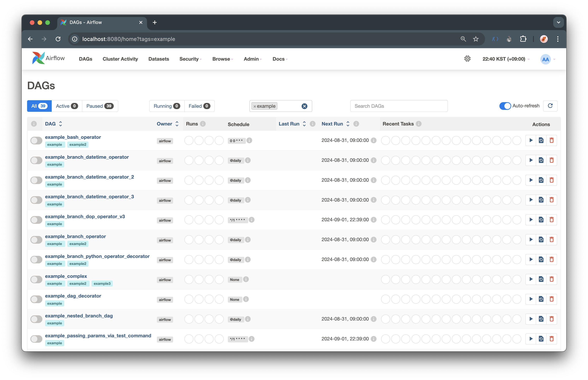
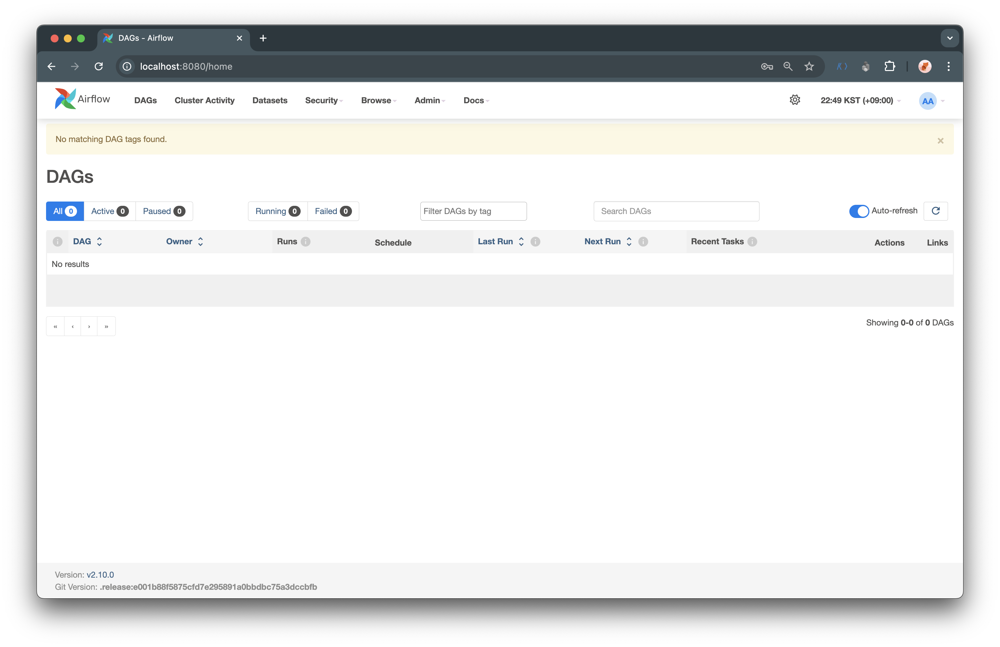

## Example DAGs

기본적으로 airflow 를 설치하게되면 다음과 같이 기본적으로 제공해주는 `DAG` 를 확인할 수 있다.  



이 예제들을 보이지 않게 설정할 수 있는데 각 환경에 따라 다음과 같이 설정해주면 된다.  

<br>

## Docker 환경

docker 환경에서는 `docker-compose.yaml` 을 통해 airflow 를 실행하게 되는데 `docker-compose.yaml` 파일에서 설정만 변경해주면 된다.  

- 변경 전

```yaml
AIRFLOW__CORE__LOAD_EXAMPLES: 'true'
```

- 변경 후 

```yaml
AIRFLOW__CORE__LOAD_EXAMPLES: 'false'
```

그럼 직접 변경하고 확인해보자.  



위의 이미지와 같이 기존에 있던 Example DAGs 가 다 사라진 것을 확인할 수 있다.  

## 서버 환경

Docker 가 아닌 서버에 직접 설치를 하는 경우 `airflow.cfg` 에서 설정을 변경해주면 된다.  

- 변경 전

```bash
load_examples = True
```

- 변경 후

```bash
load_examples = False​
```

<br>

직접 로컬 환경을 기반으로 설치해보지 않았기 때문에 직접 해보지는 않았지만 나중에 서버 환경에서 직접 구축해본다면 직접 설정해서 확인해봐야겠다.  

<br>

## 정리

이렇게 Airflow 를 설치하게되면 기본적으로 제공해주는 Example DAGs 를 보이지 않게 설정하는 방법에 대해서 알아보았다.  

복잡하지 않고 간단하게 설정할 수 있기 때문에 Example DAGs 가 필요하지 않다면 간단하게 설정하고 사용하면 좋을 것 같다.  