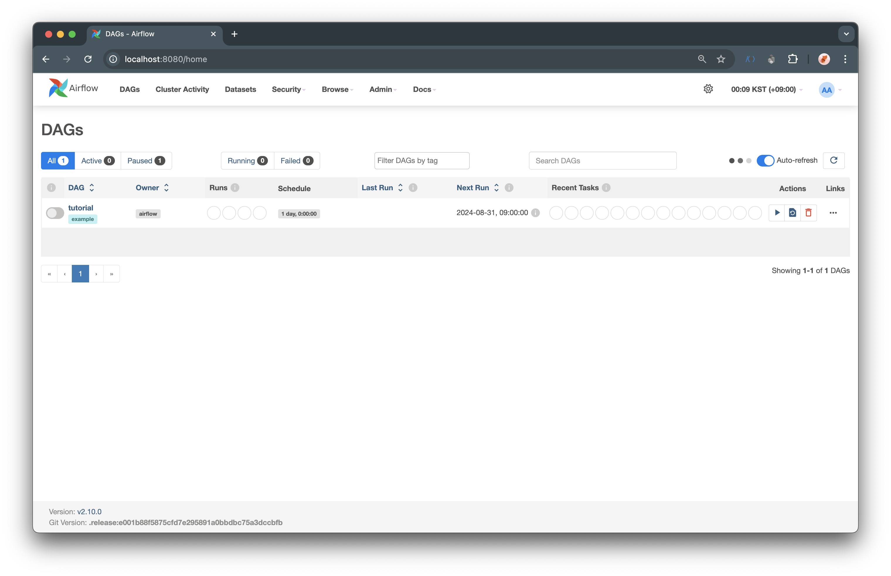
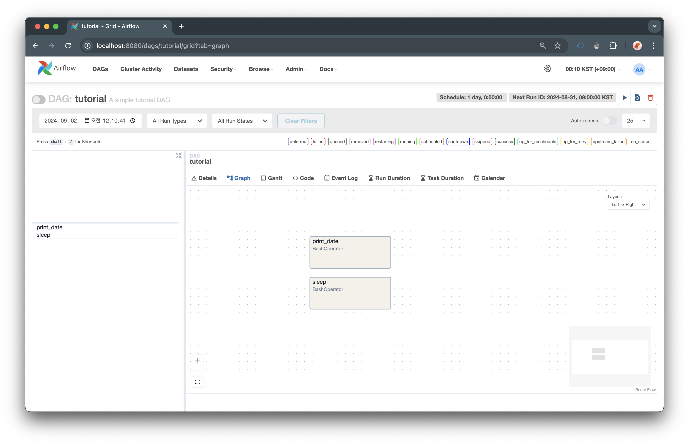

Airflow 에서 기본적인 개념이나 객체, 사용법 등을 알려주기 위해 튜토리얼을 제공해주고 있다.  
그래서 이번에는 Airflow 기본 개념과 사용법 등에 대해서 문서를 읽고 직접 해보면서 알아보려고 한다.  

참고한 문서는 아래와 같다.  

[Airflow tutorials - Fundamental Concepts](https://airflow.apache.org/docs/apache-airflow/stable/tutorial/fundamentals.html)

<br>

원래대로 라면 Example DAGs 를 제공해주어 만들어져있는 DAG 를 실행해볼 수 있지만 나는 Example DAGs 를 제거하고 직접 하나씩 만들어가면서 진행해보려고 한다.  

문서에서는 먼저 파이프라인을 정의한 DAG 를 보여준다. 이 DAG 를 통해서 한 줄씩 설명을 하면서 설명해주고 있다.  

<br>

## DAG 정의 파일

문서에서는 다음과 같이 DAG 파일에 대해서 설명해주고 있다.  

한 가지 알아두어야 할 점은 Airflow Python script 가 실제로는 DAG 의 구조를 코드로 지정하는 구성 파일일 뿐이라는 점이다.
DAG 에 정의된 실제 task 는 이 스크립트의 컨텍스트와 다른 컨텍스트에서 실행된다. 서로 다른 작업은 서로 다른 지점의 서로 다른 작업자에서 실행된다.
즉, 이 스크립트를 작업 간 교차 통신에 사용할 수 없다. 교차 통신을 하기 위한 목적을 가지는 XCom 이라는 고급 기능이 따로 존재한다.  

사람들은 때때로 DAG 정의 파일을 실제 데이터 처리를 할 수 있는 장소로 생각하지만, 전혀 그렇지 않다!
스크립트의 목적은 **<U>DAG 객체를 정의하는 것</U>** 이다. 
스케줄러가 변경 사항이 있는 경우 이를 반영하기 위해 주기적으로 실행하므로 빠르게(분이 아닌 초) 평가해야 한다.

정리해보면 DAG 파일은 실제 데이터를 처리하는 것이 아닌 DAG 를 정의하기 위한 파일이라고 이해할 수 있다.  

참고로, DAG 는 `Directed Acyclic Graph` 로 방향성을 가지는 비순환 그래프로 간단하게 이해할 수 있고 나중에 공식 문서를 통해 더 깊게 이해해보려고 한다.
혹시 궁금하다면 [Airflow - Dags](https://airflow.apache.org/docs/apache-airflow/stable/core-concepts/dags.html) 에서 확인해볼 수 있다.  

<br>

자 이제 먼저 코드를 하나씩 작성해가면서 어떻게 DAG 를 작성하는지 확인해보자.  

먼저 DAG 를 직접 작성하기 전에 DAG 파일은 airflow 환경 설정을 할 때 마운트해서 동기화시키기 위해 만들어주었던 `./dags` 폴더 안에 만들어주면 된다.
DAG 파일은 python 파일로 만들면 된다.  

따라서 나는 `./dags/tutorial.py` 파일을 만들어주었다.  

<br>

## 모듈 가져오기

먼저 DAG 를 만들기 위한 모듈을 가져와야 한다.  

```python
import textwrap
from datetime import datetime, timedelta

# The DAG object; we'll need this to instantiate a DAG
from airflow.models.dag import DAG

# Operators; we need this to operate!
from airflow.operators.bash import BashOperator
```

모듈을 가져오면서 별도로 python 과 airflow 에서 모듈을 어떻게 관리하는지 궁금하다면 [Airflow - Modules Management](https://airflow.apache.org/docs/apache-airflow/stable/administration-and-deployment/modules_management.html) 에서 확인할 수 있다.  

<br>

## 기본 매개변수

다음으로 `기본 매개변수(Default Arguments)` 를 설정해주어야 한다.  

DAG 와 각 작업을 만들 때 각 작업의 생성자에 일련의 인수들을 명시적으로 전달할 수 있는 선택권을 가지고 있다. 하지만 이런 경우는 중복해서 인수를 전달하기 때문에 매우 비효율적이다.  
따라서, 작업을 생성할 때 기본적으로 사용할 수 있는 기본 매개변수 사전를 정의할 수 있다. 다시 말해 중복해서 사용되는 인수들을 기본 매개변수로 설정하게 되면서 중복을 제거해 효율적으로 사용할 수 있다.  

```python
# These args will get passed on to each operator
# You can override them on a per-task basis during operator initialization
default_args={
    "depends_on_past": False,
    "email": ["airflow@example.com"],
    "email_on_failure": False,
    "email_on_retry": False,
    "retries": 1,
    "retry_delay": timedelta(minutes=5),
    # 'queue': 'bash_queue',
    # 'pool': 'backfill',
    # 'priority_weight': 10,
    # 'end_date': datetime(2016, 1, 1),
    # 'wait_for_downstream': False,
    # 'sla': timedelta(hours=2),
    # 'execution_timeout': timedelta(seconds=300),
    # 'on_failure_callback': some_function, # or list of functions
    # 'on_success_callback': some_other_function, # or list of functions
    # 'on_retry_callback': another_function, # or list of functions
    # 'sla_miss_callback': yet_another_function, # or list of functions
    # 'on_skipped_callback': another_function, #or list of functions
    # 'trigger_rule': 'all_success'
},
```

기본 인수에는 여러 인수들이 존재하는데 DAG 에 대한 정보, 스케줄 시간, callback 과 같은 실패 처리 등을 인수로 가지고 있다.  
그리고 이 DAG 에서는 BashOperator 를 사용하게 되는데 [airflow.models.baseoperator.BaseOperator](https://airflow.apache.org/docs/apache-airflow/stable/_api/airflow/models/baseoperator/index.html#airflow.models.baseoperator.BaseOperator) 문서를 참고해서 인수를 설정해줄 수 있다.  

또한, 다양한 목적에 맞게 다양한 인수를 설정해줄 수 있다고 한다. 예를 들어 운영 환경과 개발 환경 사이에서 다르게 설정해서 사용할 수 있다.  

<br>

## DAG 인스턴스화

작업을 중첩하기 위해서 DAG 객체가 필요하다. 
여기서는 DAG의 고유 식별자 역할을 하는 `dag_id` 를 정의하는 문자열을 전달한다.
또한 방금 정의한 기본 인수 사전을 전달하고 DAG 에 대한 `schedule` 을 1일 로 정의한다.  

```python
with DAG(
    "tutorial",
    # These args will get passed on to each operator
    # You can override them on a per-task basis during operator initialization
    default_args={
        "depends_on_past": False,
        "email": ["airflow@example.com"],
        "email_on_failure": False,
        "email_on_retry": False,
        "retries": 1,
        "retry_delay": timedelta(minutes=5),
        # 'queue': 'bash_queue',
        # 'pool': 'backfill',
        # 'priority_weight': 10,
        # 'end_date': datetime(2016, 1, 1),
        # 'wait_for_downstream': False,
        # 'sla': timedelta(hours=2),
        # 'execution_timeout': timedelta(seconds=300),
        # 'on_failure_callback': some_function, # or list of functions
        # 'on_success_callback': some_other_function, # or list of functions
        # 'on_retry_callback': another_function, # or list of functions
        # 'sla_miss_callback': yet_another_function, # or list of functions
        # 'on_skipped_callback': another_function, #or list of functions
        # 'trigger_rule': 'all_success'
    },
    description="A simple tutorial DAG",
    schedule=timedelta(days=1),
    start_date=datetime(2021, 1, 1),
    catchup=False,
    tags=["example"],
) as dag:
```

위의 코드를 보면 DAG 라는 인스턴스를 생성해 `tutorial` 이라는 `dag_id` 를 정의해주었고 `schedule=timedelta(days=1)` 를 통해 하루에 한번씩 실행되도록 스케줄을 정의해주었다.
그 외에도 DAG 가 실행되는 시작 날짜와 tags 등을 정의해준 것을 확인할 수 있다.  

<br>

## 오퍼레이터 (Operators)

오퍼레이터는 airflow 가 완료할 작업의 단위를 정의한다.
오퍼레이터를 사용하는 것은 airflow 에서 작업을 정의하는 고전적인 접근 방식이다. 
일부 사용 사례의 경우 [ Working with TaskFlow](https://airflow.apache.org/docs/apache-airflow/stable/tutorial/taskflow.html) 에서 보는 것과 같이 TaskFlow API 를 사용하는 것이 더 좋다. 
현재 작성중인 DAG 에서는 오퍼레이터를 사용하면 DAG 코드에서 작업 종속성을 시각화하는데 도움이 되기 때문에 오퍼레이터를 사용해서 task 를 생성해주었다.  

모든 오퍼레이터는 airflow 에서 작업을 실행하는 데 필요한 모든 인수를 포함하는 BashOperator 에서 상속된다. 
지금 작성중인 DAG 에서는 각 연산자는 완료하는 작업 유형에 대한 고유한 인수를 포함하고 있다. 
가장 많이 사용되는 연산자 중 일부는 PythonOperator, BashOperator 및 KubernetesPodOperator 라고 한다.  

Airflow는 사용자가 오퍼레이터에 전달한 인수를 기반으로 작업을 완료한다. 
이 튜토리얼에서는 BashOperator를 사용하여 몇 가지 bash 스크립트를 실행할 예정이다.

<br>

## 테스크 (Tasks)

DAG에서 오퍼레이터를 사용하려면 테스크로 인스턴스화해야 한다. 태스크는 DAG의 컨텍스트 내에서 오퍼레이터의 작업을 실행하는 방법을 결정한다.

다음 예제에서는 두 개의 개별 bash 스크립트를 실행하기 위해 두 개의 개별 작업으로 BashOperator를 인스턴스화합니다. 
각 인스턴스화의 첫 번째 인수인 task_id는 작업의 고유 식별자 역할을 한다.  

```python
t1 = BashOperator(
    task_id="print_date",
    bash_command="date",
)

t2 = BashOperator(
    task_id="sleep",
    depends_on_past=False,
    bash_command="sleep 5",
    retries=3,
)
```

오퍼레이터 생성자에 오퍼레이터 별로 인자(bash_command)와 BaseOperator 에서 상속된 모든 오퍼레이터에 공통된 인자(retry)를 혼합하여 전달하는 방식을 주의깊게 봐야 한다. 
이런 방식은 모든 생성자 호출에 대해 모든 인수를 전달하는 것보다 간단하다.
그리고 기본 매개변수에서 정의한 retry 횟수는 1 로 되어있지만 두 번째 테스트에서는 retry 횟수를 3 으로 재정의 하고 있다.  

- 기본 매개변수

```python
 default_args={
    ...,
    "retries": 1,
    ...,
 }
```

- 테스크에서 재정의

```python
t2 = BashOperator(
    ...,
    retries=3,
)
```

<br>

작업의 우선 순위 규칙은 다음과 같다. 

- 명시적으로 전달된 인수
- default_args 사전에 존재하는 값
- 오퍼레이터의 기본값 (있는 경우)

그리고 주의해야할 점이 있는데 다음과 같다.  

```
작업은 task_id 및 owner 인수를 포함하거나 상속해야 하며, 그렇지 않으면 Airflow에서 예외를 발생시킨다. 
Airflow를 새로 설치하면 소유자에 대한 기본값이 'airflow' 로 설정되므로 task_id 에 값이 있는지 확인하는 것만 신경 쓰면 된다. 
```

<br>

## 중간 점검

자! 여기까지 튜토리얼을 진행하게 되면 다음과 같이 DAG 가 생긴 것을 확인할 수 있다.  



그리고 DAG 상세 페이지로 들어가면 여러 정보를 확인할 수 있는데 그래프를 보면 2 개의 테스크를 확인할 수 있다.  

  

<br>

아직 테스크 간의 의존성이 정의되어있지 않기 때문에 각 테스크가 구분되어있지만 이후 튜툐리얼을 진행하면서 의존성까지 추가해주면서 하나의 파이프라인을 만들 예정이다.  

오늘은 여기까지 하고 다음에 다시 이어서 정리 해야겠다.