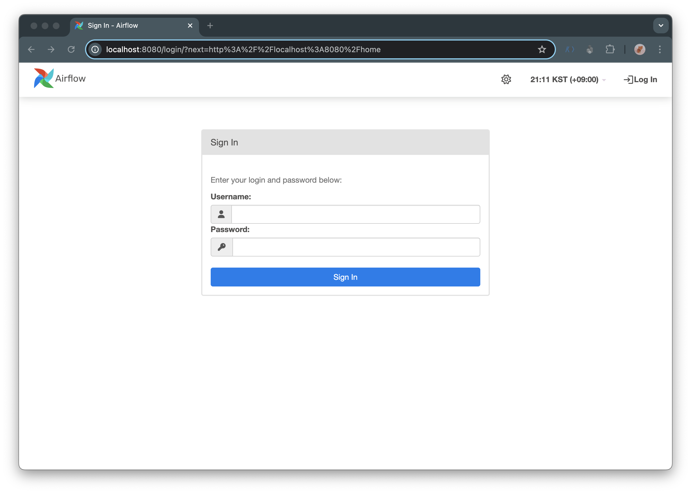
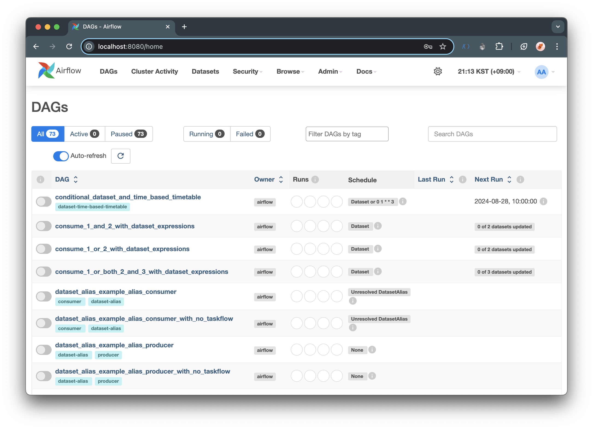

## 시작하기 앞서

나는 왜 갑자기 Airflwo 를 설치하고 있을까? 최근 이직을 하게 되면서 Airflow 를 집중해서 사용하게 될 것 같아 스스로 공부를 하고자 설치해야겠다고 마음 먹게 되었다.
쿠버네티스 환경에서 Airflow 를 설치하고 싶은데 여러 대의 서버를 통해 클러스터를 만들어주어야 하기 때문에 보다 간편한 docker-compose 를 사용해서 내가 마음껏 다뤄볼 수 있는 환경을 쉽게 만들어야겠다고 생각했다.  

그래서 직접 최신 버전의 airflow 를 설치하고 다루어볼 예정이고 Airflow 공식 문서에 있는 내용들을 하나씩 살펴볼 예정이다.  

<br>

## Airflow 설치 준비

예전에는 직접 webserver, scheduler, database 를 하나씩 만들어서 각각 따로 실행해주었던 기억이 난다.
이번에는 보다 간편하게 docker-compose 를 사용해서 airflow 를 설치해보려고 한다. 기존에도 일할 때 docker-compose 를 사용해서 airflow 를 설치했었기 때문에 쉽지 않게 설치할 수 있을 것 같다.  

Airflow 를 설치하기 앞서 공식 문서를 참고해서 진행하려고 한다.  

[Running Airflow in Docker](https://airflow.apache.org/docs/apache-airflow/stable/howto/docker-compose/index.html)

<br>

### 도커 설치

문서에서는 시작하기 전에 docker 를 먼저 설치하라고 한다. 나는 이미 docker 가 설치되어있기 때문에 넘어간다.  

### 도커 배포 파일

Docker compose 를 통해 Airflow 를 배포하려면 `docker-compose.yaml` 파일을 만들어주어야 한다.  

아래의 명령어를 통해 `docker-compose.yaml` 파일을 다운로드받을 수 있다.  

```bash
curl -LfO 'https://airflow.apache.org/docs/apache-airflow/2.10.0/docker-compose.yaml'
```

문서에서는 `docker-compose.yaml` 을 실행하기 전에 다음과 같이 유의하라고 한다.  

```
2023년 7월부터 Compose V1은 업데이트를 받지 않습니다. 
최신 버전의 Docker Compose로 업그레이드하는 것이 좋습니다. 
제공되는 버전은 docker-compose.yamlCompose V1에서 정확하게 작동하지 않을 수 있습니다.
```

### Airflow 서비스 정의

`docker-compose.yaml` 파일에는 다음과 같이 여러 서비스에 대한 정의가 포함되어있다.  

- `airflow-scheduler` : 스케줄러는 모든 작업과 DAG를 모니터링한 다음, 종속성이 완료되면 작업 인스턴스를 트리거한다.
- `airflow-webserver` : 웹서버는 http://localhost:8080 에서 이용 가능하다.
- `airflow-worker` : 스케줄러가 지정한 작업을 실행하는 작업자다.
- `airflow-triggerer` : 트리거는 연기 가능한 작업에 대한 이벤트 루프를 실행한다.
- `airflow-init` : 초기화 서비스
- `postgres` : 데이터베이스
- `redis` : 스케줄러에서 워커로 메시지를 전달하는 브로커

그리고 선택적 으로 옵션을 추가하거나 명령줄에 명시적으로 지정하여 flower 기능을 활성화할 수 있다고 한다. (--profile flower)  

- `flower` : 플라워 앱은 환경을 모니터링하기 위한 앱이다. http://localhost:5555 을 통해 접속할 수 있다.

예를 들어 아래와 같이 명령어를 추가해서 실행하면 된다.  

```
docker compose --profile flower updocker compose up flower
```

이러한 모든 서비스를 사용하면 CeleryExecutor 로 Airflow 를 실행할 수 있다고 한다.  

### Airflow 마운트

컨테이너 일부에는 디렉터리가 마운트되어있다. 즉 특정 디렉토리는 서버와 컨테이너 사이에서 동기화 된다.  

- `./dags` : DAG 파일을 여기에 넣을 수 있다.
- `./logs` : 작업 실행 및 스케줄러의 로그를 포함한다.
- `./config` : 사용자 정의 로그 파서를 추가하거나 클러스터 정책을 구성하도록 airflow_local_settings.py 파일을 추가할 수 있다.
- `./plugins` : 여기에 사용자 정의 플러그인을 넣을 수 있다.  

<br>

## Airflow 환경 설정

자 이제 docker compose 를 통해 airflow 실행해도 되지만 실행하기 전에 환경을 먼저 설정해주어야 한다.  
필요한 파일을 만들고 데이터베이스를 초기화 해주어야 한다.  

<br>

### 폴더 생성

먼저 airflow 에서 마운트해서 사용하기 위한 폴더를 생성해준다.  
아래와 같이 `./dags`, `./logs`, `./plugins`, `./config` 폴더를 생성해준다.  

```bash
mkdir -p ./dags ./logs ./plugins ./config
```

### Airflow UID 설정

리눅스 OS 환경에서는 호스트 유저 ID 가 필요하고 그룹 ID 를 `0` 으로 설정해주어야 한다.  
다음과 같이 명령어를 실행해서 `.env` 파일에 추가해준다.  

```bash
echo -e "AIRFLOW_UID=$(id -u)" > .env
```

다른 OS 환경에서는 AIRFLOW_UID 를 설정하지 않아 경고가 표시되지만 무시해도 된다. 경고를 피하고 싶다면 다음과 같이 `.env` 파일에 아래와 같이 추가해주면 된다.  

```bash
AIRFLOW_UID=50000
```

나는 리눅스 환경이 아닌 MacOS 에서 진행할 예정이라 위와 같이 .env 파일에 AIRFLOW_UID 를 추가해주었다.  

### 데이터베이스 초기화

모든 OS 환경에서 데이터베이스 마이그레이션을 실행해야하고 계정을 생성해주어야 한다. 그래서 다음과 같이 명령어를 통해 데이터베이스를 초기화해준다.  

```bash
docker compose up airflow-init
```

초기화가 정상적으로 완료된 로그를 확인해보면 다음과 같이 계정이 생성된 것을 확인할 수 있다.  

```bash
(...)
airflow-on-docker-airflow-init-1  | [2024-08-30T11:55:52.451+0000] {override.py:1543} INFO - Added user airflow
airflow-on-docker-airflow-init-1  | User "airflow" created with role "Admin"
airflow-on-docker-airflow-init-1  | /home/airflow/.local/lib/python3.12/site-packages/airflow/plugins_manager.py:30 DeprecationWarning: 'cgitb' is deprecated and slated for removal in Python 3.13
airflow-on-docker-airflow-init-1  | 2.10.0
airflow-on-docker-airflow-init-1 exited with code 0
```

<br>

## 만약 제대로 설치가 되지 않았다면

지금까지 했던 모든 과정을 제거하고 다시 처음부터 다시 시작하는 게 좋다고 한다.  

그래서 다음과 같이 진행한다.  

- docker-compose.yaml 파일이 다운로드된 디렉터리에서 `docker compose down --volumes --remove-orphans` 명령어를 실행한다.
- docker-compose.yaml 파일이 다운로드된 디렉터리에서 전체 디렉터리를 제거한다. `rm -rf '<DIRECTORY>'`
- docker-compose.yaml 파일을 다시 다운로드 받고 가이드를 통해 처음부터 다시 설치를 진행한다. 

<br>

## airlfow 실행

airflow 를 실행하는 방법은 매우 쉽다. docker-compose 를 실행하면 된다.  

```bash
docker compose up -d
```

명령어에서 `-d` 옵션은 detach 모드로 docker compose 를 실행하게되면 백그라운드로 실행되어 다른 작업이 가능하다.  

### 도커 컨데이터 확인

정상적으로 실행이 되었다면 docker container 의 상태를 확인해보면 된다.  

```bash
CONTAINER ID   IMAGE                   COMMAND                   CREATED         STATUS                        PORTS                    NAMES
22e621200456   apache/airflow:2.10.0   "/usr/bin/dumb-init …"   2 minutes ago   Up About a minute (healthy)   8080/tcp                 airflow-on-docker-airflow-scheduler-1
3ceaecdcb766   apache/airflow:2.10.0   "/usr/bin/dumb-init …"   2 minutes ago   Up About a minute (healthy)   0.0.0.0:8080->8080/tcp   airflow-on-docker-airflow-webserver-1
d7d881e7a99a   apache/airflow:2.10.0   "/usr/bin/dumb-init …"   2 minutes ago   Up About a minute (healthy)   8080/tcp                 airflow-on-docker-airflow-worker-1
4130c047810a   apache/airflow:2.10.0   "/usr/bin/dumb-init …"   2 minutes ago   Up About a minute (healthy)   8080/tcp                 airflow-on-docker-airflow-triggerer-1
a6858f8eb207   postgres:13             "docker-entrypoint.s…"   2 minutes ago   Up 2 minutes (healthy)        5432/tcp                 airflow-on-docker-postgres-1
d6e68bc70dce   redis:7.2-bookworm      "docker-entrypoint.s…"   2 minutes ago   Up 2 minutes (healthy)        6379/tcp                 airflow-on-docker-redis-1
```

STATUS 에서 starting 상태에서 healthy 상태로 변경되면 정상적으로 실행되었다고 볼 수 있다.  

### 웹 서버 접속

그리고 정상적으로 실행이 되었따면 webserver 에 접속이 가능하기 때문에 http://localhost:8080 으로 접속해본다.  



위의 사진과 같이 로그인 화면이 나온다면 정상적으로 Airflow 가 실행되었다고 보면 된다.  

계정은 아까 데이터베이스 초기화를 진행하면서 계정을 생성했었는데 `ID: airflow / PASSWORD: airflow` 를 통해서 접속할 수 있다.  

다음과 같이 DAG 가 정상적으로 보이면 설치가 잘 끝났다!

