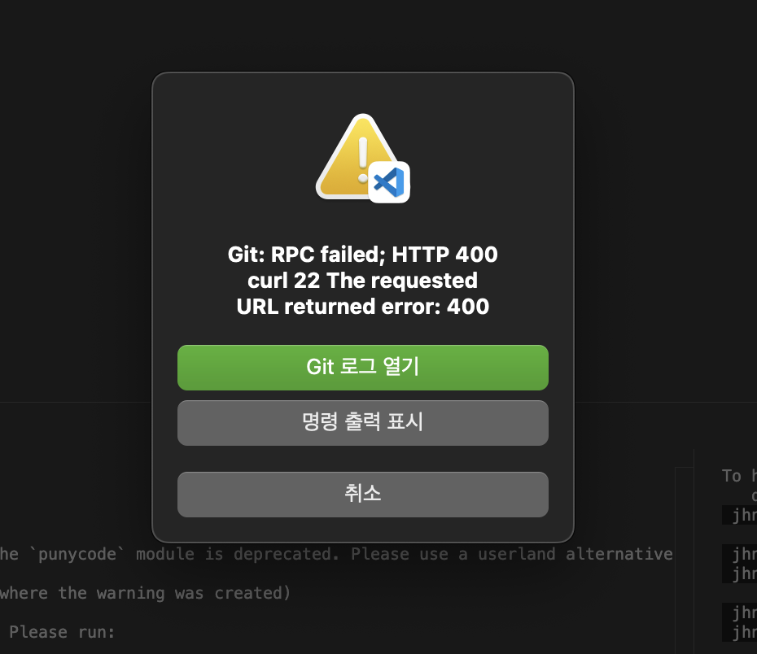

## Git Push 문제

git commit 을 진행하고나서 push 를 하려고 하니 다음과 같이 에러가 발생했다.  



실제 git log 를 확인해보니 다음과 같이 에러 메시지를 확인할 수 있었다.  

```python
[info] error: RPC failed; HTTP 400 curl 22 The requested URL returned error: 400
send-pack: unexpected disconnect while reading sideband packet
fatal: the remote end hung up unexpectedly
Everything up-to-date
```

HTTP 400 에러는 Bad Request 에러로 클라이언트의 요청을 서버에서 처리할 수 없을 때 발생하는 것으로 알고 있고 아무래도 네트워크 문제이거나 내가 push 하려는 파일의 크기가 너무 커서 그런건 아닌가? 하는 생각이 들었다.  
그래서 해당 에러 메시지 관련해서 에러가 발생한 원인과 해결할 수 있는 방법을 찾아보았다.  

<br>

## 문제 원인 파악

여러 사람들의 문제를 통해 확인한 문제의 원인은 다음과 같았다.  

- push 데이터의 크기 문제
- 네트워크 문제
- Git 서버 문제
- Git Repository 에 대한 권한 문제

나도 사람들이 말한 원인과 관련이 있는지 하나씩 확인해보았다.  

<br>

## 해결 방법 찾기

해결 방법으로는 다음과 같이 시도해보라고 한다.  

- HTTP 버퍼 크기 늘리기
- 작은 사이즈로 푸시해보기
- 모든 서버 종료하기
- Git Repository 연결 다시하기
- Git Repository 권한 연결 다시하기
- Github 에 문의하기

<br>

나는 먼저 push 데이터의 크기가 문제인지 확인해보았다.  

기존에 push 하려고 했던 commit 내역들을 undo 하고나서 간단하게 수정하고나서 commit 하고 push 해보았다.  
간단한 수정 내용만 push 하니 정상적으로 되는 것을 확인했다.  

### HTTP 버퍼 늘리기

그래서 다시 commit 하고나서 push 하니 동일한 에러가 발생했다. 결국에는 버퍼 크기 문제인건가 하는 생각에 찾은 글 중에서 http 버퍼를 늘려주는 방법을 해보았다.  

아래의 명령어를 통해 버퍼 사이즈를 500MB 로 늘려주었다.  

```bash
git config http.postBuffer 524288000
```

반대로 설정을 지우려면 아래 명령얼르 통해 제거해준다. 

```bash
git config --global --unset http.postBuffer
```

그리고 다시 시도하니 정상적으로 push 되는 것을 확인했다!  
결국 내 문제는 push 하려고 하는 데이터의 용량이 너무 커서 push 가 되지 않았던 것이었다. 아마 이미지를 같이 올려서 그렇 것 같은데.. 저번에는 왜 정상적으로 push 가 되었는지 잘 모르겟다.  

따라서 용량이 얼마나 되었길래 안되었는지 commit 한 데이터의 크기를 확인해보았다.  

먼저 다음 명령어를 통해서 최근 commit 내역을 통해 commit hash 값을 알아낸다.  

```bash
git log --oneline
```

그리고 아래의 명령어를 통해 커밋 내역을 확인할 수 있다.  

```bash
git cat-file -p <commit-hash>
```

그럼 아래와 같이 커밋 트리를 확인할 수 있다.  

```bash
$ git cat-file -p 15a210b
tree 564b23648ae9e4f50d12a5b58c9d7d1874b3e396
parent a7fdc8c018d026dffa15648ce89bb46951a1bc68
(...)
```

이제 아래의 명령어로 

```bash
git cat-file -s <tree-hash>
```

결과를 확인해보면 622 바이트가 나오는데 생각보다 크지 않아서 뭔가 싶었다...

```bash
$ git cat-file -s 564b23648ae9e4f50d12a5b58c9d7d1874b3e396
622
```

<br>

흠.. 정확히 왜 그런건지 잘 모르겠다. 당장에는 버퍼를 늘려서 이슈를 해결할 수 있었지만 다음에도 같은 이슈가 생기면 더 찾아봐야겠다.  


<br>

## 참고

https://stackoverflow.com/questions/77856025/git-error-rpc-failed-http-400-curl-22-the-requested-url-returned-error-400-se  
https://stackoverflow.com/questions/62753648/rpc-failed-http-400-curl-22-the-requested-url-returned-error-400-bad-request  
https://toypanda.tistory.com/222  
https://onlydev.tistory.com/130  
https://g1-kim.tistory.com/entry/git-push-400-%EC%97%90%EB%9F%AC-%EB%B0%9C%EC%83%9D-%EC%8B%9C-ssh-%EB%A1%9C-%EC%97%B0%EA%B2%B0-%ED%95%B4%EA%B2%B0%EB%B0%A9%EC%95%88  
https://hyeonstone.tistory.com/entry/Git-%EC%98%A4%EB%A5%98-The-requested-URL-returned-error-400-%EC%98%A4%EB%A5%98  