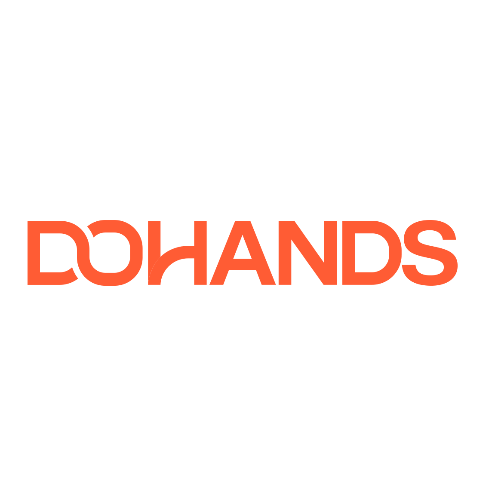

    
    
두핸즈 로고

### 면접 합격 소식 그리고 면접 준비

두핸즈 1차 면접을 보고 난 뒤 일주일 뒤 한 통의 전화가 왔다. 
나는 그 순간 지난 주 봤던 면접이라는 생각이 들어 바로 받게 되었고 합격이라는 소식을 듣게 되었다. 
최종 면접에서는 CTO 님과 대면 면접으로 진행될 예정이라고 하셨고 그렇게 최종 면접을 보게 되었다. 
그리고 또 한 가지 평판 조회를 하고 있는데 동의하냐는 물음에 나는 많은 분들이 평판 조회에 동의를 하시냐고 물어보았다.
대답은 대부분의 지원자분들이 해주고 계신다는 답변이었다. 그래서 나도 동의한다고 말씀드리고 평판 조회에 대한 안내를 받았다.  

사실 나는 평판 조회에 대해서 매우 부정적인 편이라고 생각한다. 그 이유는 정말 평판 조회가 사람을 보는데 중요한 걸까? 하는 생각도 많이 들었고 물론 어느 정도 사람들 보는데 도움이 될 수는 있다고 생각한다. 
하지만 결국에는 친한 지인들에게 평판을 작성해달라고 부탁하는 일이 당연히 빈번하게 일어날 것이고 좋지 않게 써주는 사람이 있을까? 하는 생각도 들었다. 물론 내가 전직장분들과 연락을 잘 하지 않았던 것도 맞지만 갑자기 연락드려서 평판 조회를 해주실 수 있을까요? 하고 물어보는 것도 매우 실례가 아닌가 생각이 든다.
그래서 평판 조회에 대한 안내를 받았지만 하지 않기로 했다. 면접 결과에 영향을 주지 않는다고 했고 하지 않았을 경우 면접관님께서 보는 정보가 줄어드는 것 뿐이라고 인사 담당자분이 말씀하셨기 때문에 평판 조회를 위해 시간을 보내는 것보다 면접 준비에 더 시간을 들였던 것 같다.  

### 최종 면접 시작

그렇게 면접일이 다가오고 오랜만에 보는 면접이라 긴장을 많이 했던 것 같다. CTO 님과 일대일 면접으로 진행되었고 자기소개를 시작으로 면접이 시작되었다.  

간단하게 자기소개를 하고나서 단골 질문인 이직하려고 하는 이유에 대한 질문이 이어졌다. 이직 사유가 명확했기 때문에 솔직하게 말씀드렸던 것 같다. 열심히 이직하려고 하는 이유에 대해서 설명하고나서 내 커리어에 대한 질문을 받게 되었다.
나는 처음에 시스템 엔지니어로 시작해서 현재에는 데이터 엔지니어로 일을 하고 있기 때문에 지금까지 오게 된 과정과 시스템 엔지니어를 커리어를 포기하면서 데이터 엔지니어가 되려고 하는 이유 그리고 데이터 엔지니어 일을 하면서 흥미로운 점, 왜 되고 싶은지에 대한 질문을 받았다.
솔직하게 말씀드렸는데 뭔가 지금 생각해보면 횡설수설한 것 같기도 하고 스스로가 내 커리어에 대해서 많은 아쉬움도 가지고 있었기 때문에 조금 더 자신있게 말씀드리지 못했던 것 같기도 하다.  

그리고 곤란한 질문을 하나 받았는데 지난 페이히어 최종 면접에서도 받았던 질문이었기 때문에 어느 정도 대비는 되어있었지만 그래도 곤란한 질문이었던 것 같다. 
만약 두핸즈에서 일을 하다가 퇴사하게 된다면 어떤 이유일 것 같냐는 질문이었다. 이 질문은 정말 애초에 퇴사할거라는 생각을 가지고 회사에 지원하는 경우가 없기 때문에 생각조차 하지 못했고 생각이 들지도 않았던 것 같다. 어떻게든 회사에 들어가기 위한 준비와 생각만 하기 때문에 대답하기가 정말 곤란했던 것 같다.
그래서 나는 지금까지 내가 퇴사를 결정했던 이유에 대해서 설명을 드렸고 어쩔 수 없는 상황이 발생해 퇴사를 결심하게 되었다는 점을 말씀드리면서 이런 경우가 발생하지 않는다면 퇴사할 생각은 없다고 말씀드렸다.    

계속해서 회사를 볼 때 중요하게 생각하는 부분은 무엇인지에 대해서도 물어보셨다. 나는 그동안 내가 생각해왔던 자기 서비스를 하고 주도적으로 업무를 할 수 있는 문화와 성장하려고 하는 분위기 등에 대해서 설명을 드렸는데 면접관님께서는 현재 회사에서의 상황을 겪으면서 달라진 점은 없는지에 대해서도 물어보셨다. 
그래서 비즈니스 모델이 있는 수익이 어느 정도 발생하는 회사였음 좋겠다고 솔직하게 말씀드렸던 것 같다. 그 이유는 지금 회사의 비즈니스 모델이 없고 수익이 없었기 때문에 재정적인 어려움을 많이 겪었기 때문에 그렇게 말씀을 드렸던 것 같다.  

그러고나서 기술적인 부분에 대해서도 물어보셨다. 1차 면접 때 받았던 질문들과 내가 했던 대답을 통해 다시 한 번 더 질문을 주셨다. Airflow 를 내가 직접 선택해서 사용한 건지 아니면 이미 사용하고 있었던 것인지 그리고 Airflow 가 가장 좋은 플랫폼이라고 생각하는지 다른 플랫폼은 없는지, Airflow 가 좋은 이유는 무엇인지, Nifi 는 어떤지 등에 대해서 물어보셨다.
그리고 Spark 에 대한 질문도 받았는데 MapReduce 가 무엇인지 물어보셨는데 예전에 하둡에 대해서 공부할 때 알고있는 내용이었고 최근에는 들여다보지 못해 잊고있던... 맵리듀스.. 그래도 정확하지는 않더라도 기본적인 구조에 대한 이해는 하고 있어 기억나는 대로 말씀드렸지만 제대로 얘기했는지는 잘 모르겠다. ㅎㅎ
또 온 프레미스에서 운영하는 것과 클라우드에서 운영하는 것에 대한 차이가 무엇이 있는지, 그리고 데이터 엔지니어와 데이터 사이언티스트의 차이가 무엇이고 데이터 사이언티스트와 관련된 업무를 해본 적이 있는지에 대해서 물어보셨다. 이때 예전에 부트캠프에서 했던 추천 시스템에 대해서 말씀드렸는데 협업 필터링을 사용하면서 코사인 유사도를 왜 사용했을까 하는 질문에 대답을 잘 못했던 것 같다.
사실 그때 너무 정신없이 만드는 데 집중하느라 이유를 생각할 시간이 부족했던 것 같다. 그래서 지금도 질문에 대한 답을 생각해보면 대답을 잘 하지 못할 것 같다.  

이렇게 기술에 대한 질문을 마무리하고 나서 업무적인 부분으로 넘어갔다. 어떤 상황을 말씀해주시고 그 상황에서 어떻게 할 것인가 하는 질문이었는데 매우 곤란한 질문이었다. 개발자가 잘못된 스키마를 통해 데이터를 사용하고 있는데 변경해달라고 말을 해야하는데 어떻게 할 것이냐... 변경해달라고 요구해도 개발자가 싫다고 하면? 이런 식의 질문들이 이어졌다.
대답을 하고 나면 상황이 하나씩 추가되었고 거의.. 점점 파국으로 간다고 해야하나..?ㅎㅎㅎㅎ <S>솔직히 이정도면 개발자가 인성에 문제가...ㅎㅎㅎ</S>  이렇게 업무적으로 불편한 상황이나 충돌이 발생할 경우에 대한 내 태도나 행동을 보려고 하셨던 것 같다. 어떻게든 지금까지 해온 경험을 바탕으로 잘 설명을 하긴 했지만 너무 어려운 질문이었던 것 같다.
나는 사실 어떻게 보면 최대한 불편한 상황을 피하려고 하고 좋게 해결하려고 하는 편이다보니 그런 트러블이 발생한 적이 매우 적기도 했고 불편하더라도 내가 처리하거나 대화로 잘 풀어나갔었기 때문에 매우 곤란한 질문이었던 것 같다.  

그리고 다음 상황이 주어졌다. 어떤분이 하루에 3번 이상 계속해서 데이터를 요청해주신다. 그런데 가지고 있는 데이터가 아닌 새로운 데이터를 수집해서 달라고 한다. 이럴 때 어떻게 할 것인가... 하는 질문이었는데 예전에도 이런 적이 많았고 기상청 때에도 그리고 키다리스튜디오에 다닐 때에도 Ad-hoc 업무를 했었기 때문에 열심히 대답을 했던 것 같다.
결론은 커뮤니케이션을 얼마나 잘하는가에 따라서 그 상황이 충분히 좋아질 수 있다고 생각을 했었기 때문에 최대한 대화를 통해 해결하겠다는 말을 많이 했던 것 같다.  

이렇게 열심히 대답을 하고나서 질문을 드렸는데 앞으로의 방향이나 문화와 같은 부분들에 대해서 질문을 드렸던 것 같다. 그렇게 최종 면접이 마무리가 되었다. 마지막에 주어진 상황들에 대해서 대답을 하다보니 머리가 너무 아팠던 것 같다. 면접을 보고 밖에 나오지 정말 기가 다 빨렸던 것 같다.
그리고 드는 생각은 흠... 떨어진 것 같은데..? ㅎㅎ 라는 생각이었다. 뭐랄까 받으 질문들을 통해서 느꼈던 점은 내가 만약 두핸즈에 들어가게 되면 질문해주신 업무들을 주로 하게 되겠구나 하는 생각도 들었고 저런 상황에 놓였을 때 잘 버틸 수 있는 사람이 필요해보였다. 
주로 소프트 스킬을 보신 것 같았고 경력이 많지 않아도 조금의 엔지니어링에 대한 이해와 곤란한 상황에서도 잘 해결할 수 있는 커뮤니케이션만 가지고 있는 사람을 원하는 느낌이라고 해야하나...?  

그리고 한편으로는 내가 만약 두핸즈에 들어가게 된다면 정말 내가 원하는 업무를 할 수 있을까? 그리고 데이터 엔지니어로써 성장할 수 있을까? 많은 경험을 해볼 수 있을까? 하는 생각도 들게 되었던 것 같다. 
다시 팀을 빌딩하고 있고 내가 그 과정에서 처음부터 참여해서 데이터 파이프라인을 구축하고 한다는 점은 매우 좋다고 생각하지만 더 많은 데이터들을 다루어보고 싶고 더 큰 데이터들을 다루는 경험도 해보고 싶은 생각이 한 켠에 자리잡고 있는 것 같다.  

요즘에 뭐라고 해야할까..  
어떤 상황이 주어지더라도 내가 열심히 한다면 무엇이라도 얻어갈 수 있다고 생각하는 게 맞는건지 아니면 내가 원하는 상황이 아니니까 내가 원하는 상황을 찾아서 가야하는 건지에 대한 고민이 많이 드는 것 같다.
지금 회사에서 주어진 상황이 좋지 않더라도 아무리 열심히 하고 노력해봐도 상황은 그대로였고 나아지는 건 없었고 나 스스로가 이곳에서 더 성장하지 못할 것 같다는 생각이 드는 순간 그 자리에서 멈추게 되었던 것 같다.  

오랜만에 면접을 보게 되었고 그래도 나름 열심히 봤다고 생각하는데 솔직하게 면접 때를 되돌아보면 결과는 좋지 않을 것이라는 생각이 먼저 드는 것 같다.   

정말... 쉽지 않다... 🤣